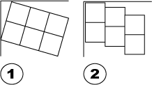
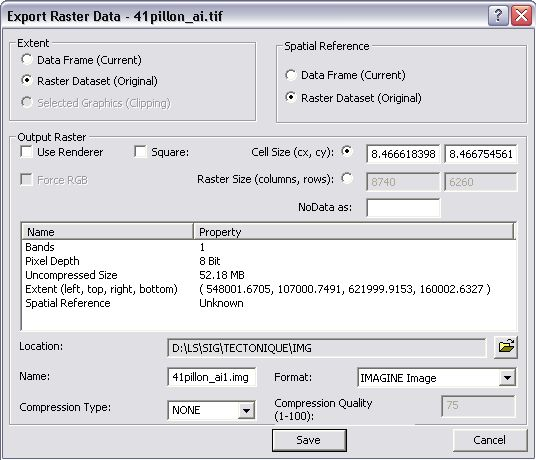
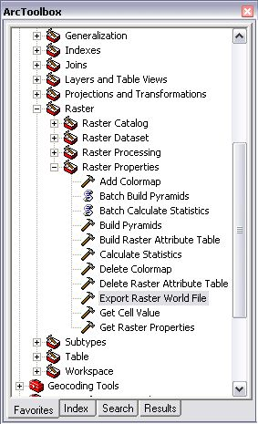

Rotation Warning
====================

Introduction
-------------------------
Some raster files have associated rotation information. This indicates that an appropriated rotation should be applied for the raster to be correctly displayed. ToolMap display a Warning when such files are encountered because displaying those files with rotations isn’t supported yet.

To still use those images we need to convert them into non-rotated raster. Following method may be used for that purpose:

#. Rotated raster.
#. Exported non rotated raster

Using ArcGIS
-------------------------

  - Load the raster
  - Right-click the raster name in the Table of contents
  - :menuselection:`Choose Data --> Export Data`
  - Select the Location, file Format and file name
  - Press Save

The new raster is now correct and didn’t contain anymore rotation information

Note about word files (tfw)
------------------------------

Since ArcGIS 9.2 no more word files (tfw) are written and the georeferencing information is now stored in a aux.xml file(see ESRI help: http://tinyurl.com/68ykjqu). It is however possible to manually create such word file using "Export Raster Word File" tool from the ArcToolBox

