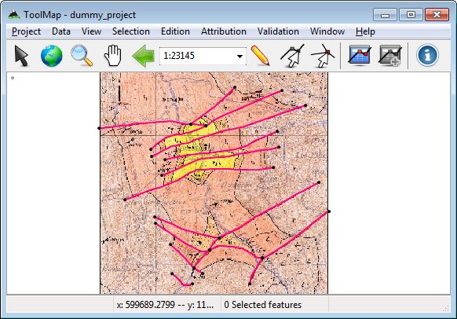

Advanced Vectorization
=======================

This topic relate all the strategies concerning the vectorization.

Homogenized drawing
---------------------------------

If you want your final results to be consistent you should allways draw your lines at the same scale. In addition, to get smooth results your drawing scale shall be at least 10 time bigger as the original map. By doing so you will see nice and round lines instead of sharp edged segmented ones.

exemple: for a 1:10'000 map digitize your lines at a 1:1'000 scale

Clean intersections
---------------------------------

When having a enormous project, the number of intersections increase fearsomely. It would be better to have a way to draw them properly without worries. For that purpose the tool :ref:`create-intersection` is really handy.

Start with the drawing of the biggest structures and vectorize them without interruption. By proceding like that you insure the clearness of those lines. I would either recommand to directly attribute those lines.

As you can see on the picture above, there is a lot of intersections totally ignored. Now draw the smaller features the same way you would do near the frame (i.e. wider than needed) and directly attribute them. Then:

#. :kbd:`Ctrl+I`: It automatically creates the intersections and cut the lines.

#. :kbd:`Shift + select`: Unselect the part you want to keep.

Now your selection is composed only by two superfluous lines you can delete.

.. image:: img/tutorial-intersection2.png

As a result you have:

  * Two intersections with very continuous lines on every sides.
  * Insurance there isn't any snapping issues.
  * Lesser segments to attribute. Just make sure to add a new attribution on the newly created segments if needed.