Verification workflow
============================

First of all I must encourage you to regularly check your work so your final verification won't be a total disaster.

Anyway following this step-by-step verification workflow shall help you to  progressively erase the different errors to stay, at the end, with a legible project.

.. important:: Remember to frequently back up your project before modifying it. We want to avoid as many hair torn off as possible.

Lines
-------------------

The biggest part of this tutorial is dedicated to the lines as it is the layer where most of the errors occur.

Remove small lines
^^^^^^^^^^^^^^^^^^^^^^^^^^^^^^^^^

While vectorizing and using the tools ToolMap provides you, it is possible to have the emergence of very small lines. There is basically two types of "small lines":

  - The line don't have any length, its vertices are at the same coordinates
  - The line has a length, its vertices have different coordinates even if close.

To quickly identify those irregularities, create a query.

:menuselection:`Validation --> [[man:validation#semantic_validation|New query...]] --> by length`

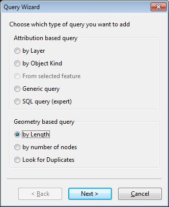

You will have to edit the length you want to check, in your case: 1. Feel free to check also lines smaller than 2,3,4,5... But remember that a line with distinct vertices may be correct while the other case is always useless.

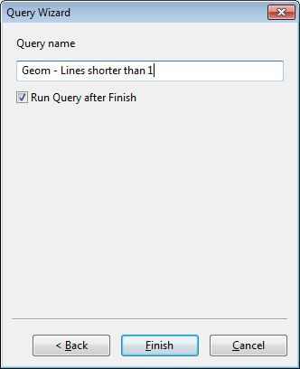

As you can see on the status bar at the bottom of the window, the query selected 5 features with a length smaller than 1. Before deleting them, let's have a look with the Information window.

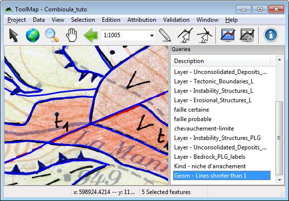

:menuselection:`Window --> [[man:funct#information_window|Information window]]`

The information window displays all the selected features and displays the data of each of them. From there, you can find out their location using the option //move to// accessible via the contextual menu. I recommand you to work with a very small scale as ToolMap cannot zoom on features without geometrical meaning. This step has a real importance if checking lines bigger than 0; knowing they may not be mistakes.

:menuselection:`Right-click on feature --> Move to`

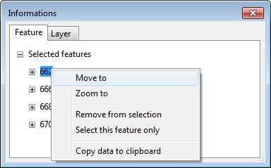

When you are certain your lines are indeed errors, you can delete them. Then, increase the value of the query to look for bigger lines. Directly check for lines smaller than 5. As for that you can either create a new query or edit your actual one.

:menuselection:`Right-click on query --> Edit query SQL...`

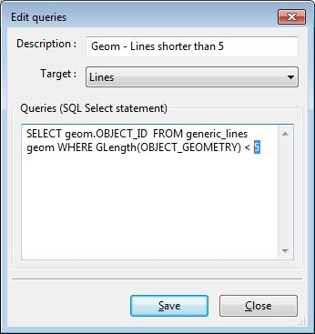

The query selected one new feature, but while checking it, it seems to be legitimate. There is a remaining question though. Was this small line intentionnal? is it necessary? or can you avoid it by redrawing the nearby lines differently?

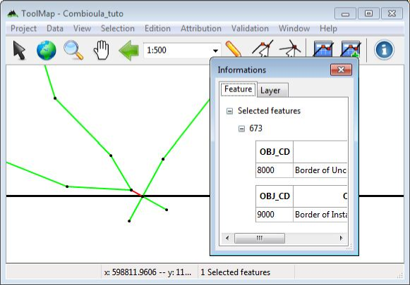

Check geometries
^^^^^^^^^^^^^^^^^^^^^^^^^^^^^^^^^

After removing the small lines you can now check for the geometry of the other lines. Therfor use the tool `check geometries validity`.

:menuselection:`Validation --> Check geometries validity`

This tool will sort out every geometry with inconsistencies from your selected layer (In the table of content). As you already removed the 0 length lines, this tool will mainly search for lines overlapping themselves.

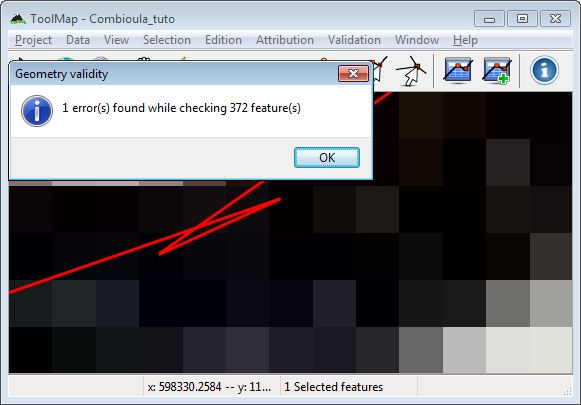

As you can see the line have a strange behaviour. The main cause of this mistake is an unwanted double-click while drawing the line. By deleting one of the vertices or by moving them the problem can be solved.

You may want to directly use this tool instead of the query in the previous step ([[tutorial:verification&#remove_small_lines|remove small lines]]), but I hardly disencourage you to do that. The reason is that this tool can select overlapping lines which you just want to correct instead of deleting.

Looking fo duplicates
^^^^^^^^^^^^^^^^^^^^^^^^^^^^^^^^^

One more error you can easily find are the duplicated lines. With the help of a query sort out the lines which have identical geometry. A line shall never be drawn twice in ToolMap as you just add more object attributes to one line if she has more than one purpose.

:menuselection:`Validation --> New query... --> Look for duplicate`

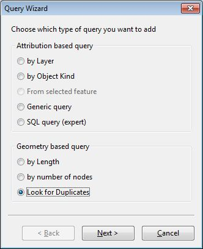

The query selected one line, using the [[man:visualization#lines|multiple symbology]] and the `information window` you can isolate the problem. In this case there is a second line without any attribution, simply erase it. But if both lines had an attribution you should have considered to give the full attribution to one of the two before cleaning the duplicate.

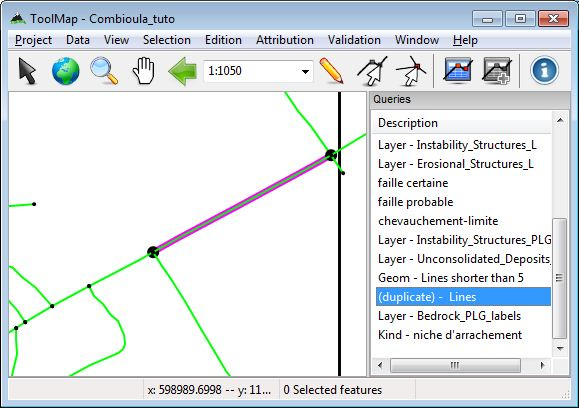

Look for lines without attribution
^^^^^^^^^^^^^^^^^^^^^^^^^^^^^^^^^^^^^^

Well this case is, I'm sure, kind of obvious for everybody but a line without attribution in ToolMap is more than useless. The query panel originaly contains 3 queries which are `lines, points and labels without attribution`. Using those queries and the `multiple symbology` you can highlight every line without attribution and give it its right attribution (because people don't usually draw lines for nothing).

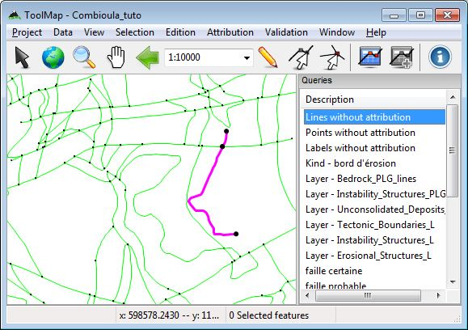

Dangling nodes
^^^^^^^^^^^^^^^^^^^^^^^^^^^^^^^^^

At this stage your lines shall be pretty much clear. What you want to avoid now are the problems related to the polygons. First of all, check the integrity of your borders of polygon. To do that you have the tool called Dangling nodes.

:menuselection:`Validation --> [[man:validation#geometrical_validation|Dangling Nodes...]]`

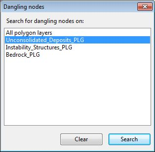

I recommend you to use the tool once for each layer instead of searching on all polygon layers. It is easier to identify the mistakes when you already know which layer lies the problem on.

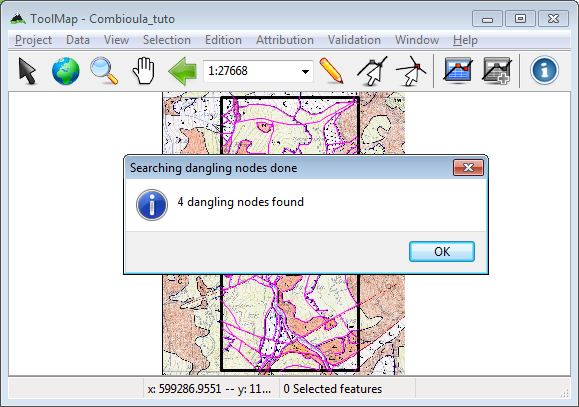

The dangling nodes are displayed with white and red points. There is two factors for having dangling nodes:

  - missing attribution: One segment of the line is inadequately attributed, the line is not closed.\\ .. image:: img/tutorial-danglingnodes3.png\\
  - bad snapping: The vertices are not snapped.\\ .. image:: img/tutorial-danglingnodes4.png

The solutions are then simple. For a missing attribution, attribute the line; for a bad snapping, modify the line with a big enough snapping radius.

Attribution
^^^^^^^^^^^^^^^^^^^^^^^^^^^^^^^^^

This is the most simple yet harder part to check. The only way for you to control if all your attributions are correctly made before exporting is with the `multiple symbology`. I can only recommand you to check every layer individually by hiding the other lines and search for a forgotten attribution.

Labels
-------------------

Even if labels, like points, have little chance (no chance at all) to have geometrical errors, ToolMap makes use of them to build the polygons. It is also important to verify them.

Look for labels without attribution
^^^^^^^^^^^^^^^^^^^^^^^^^^^^^^^^^^^^^^

A label without attribution means a polygon without attribution. Using the query `Labels without attribution` and the `multiple symbology` you can highlight the labels which are not attributed.

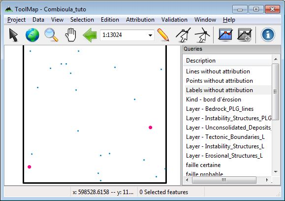

You can then correctly assign them their objects/attributes.

Look for missing/additionnal labels
^^^^^^^^^^^^^^^^^^^^^^^^^^^^^^^^^^^^^^^

Depending on the complexity of your map, you may forget to draw a label or you may draw two or more labels in the same polygon. To check those mistakes, use the `redactor mode`. The `redactor mode` allows you to export a specific layer and directly reimport it into ToolMap as a support theme.

I recommand you to create a special export folder for this operation as you will most likely export more than once the same layers.

:menuselection:`Project --> [[man:validation#redactor_mode|Export layer...]]`

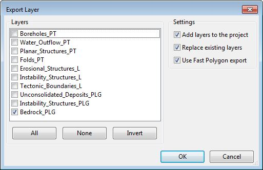

The layer will now be imported in ToolMap as a shapefile. It allows you to use the `multiple symbology` and to classify the polygons by `number of labels`.

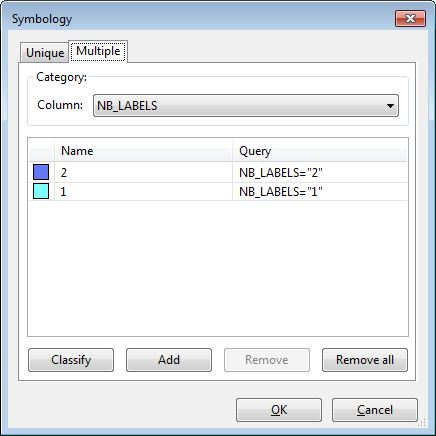

By using the `multiple symbology` on the labels related to your layer as well, you can have a clear view of the different polygons created.

.. image:: img/tutorial-creator3.png

You can now clearly see that there is a polygon with two labels. Obviously you can identify the missing labels if a polygon is not drawn. The goal is now to correct those mistakes and directly reimport the layer. Due to the option `replace existing layer`, the settings of your symbology will remain, but your layer will be updated according to your modifications.

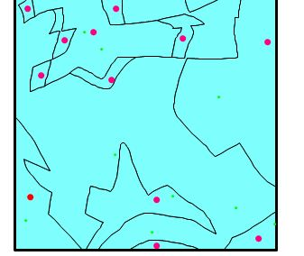

Restart this operation as many times as needed and on every polygonal layer. With the same process you can also check if your labels are correctly attributed by classifying them by `object description` instead of number of labels.

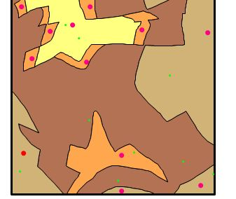