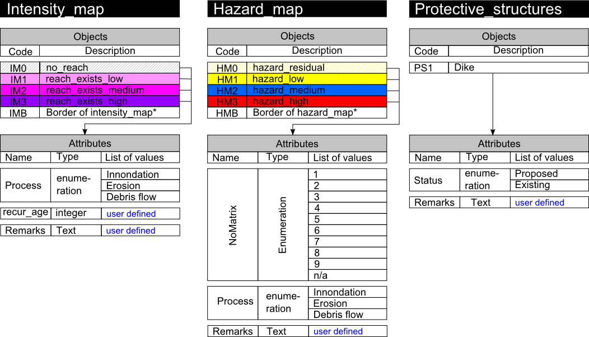
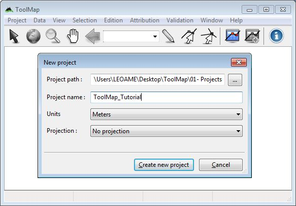
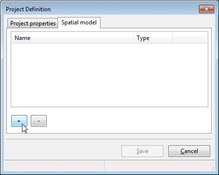
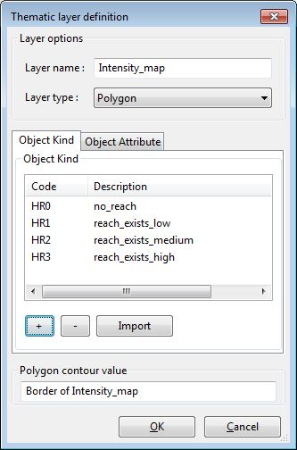
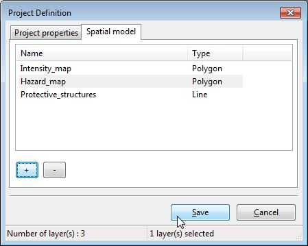
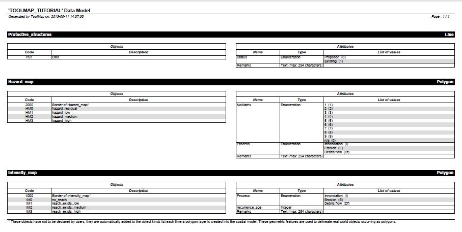

What is the data model?
===========================

The data model is a structure of data composed to represent the reality you want to vectorize. In the data model lay all the information you want to get at the end of your work. It sorts the data of the same nature together in layers. Seeing that fact, the more intricate a project is the more layers you shall have.

Those layers may represent 3 types of geometries:

  * Points
  * Lines
  * Polygons

Practical case
-----------------------------

.. warning:: All the following data are sample data. We doesn't warrant their accuracy, completeness or suitability for any purposes.

In the subsequent case you will follow the realization of a new project. It is the hazard study of an area. The goal is to digitize the data properly. After analyzing them thoughtfully you can divide them in 3 different layers:

  * A line layer containing information of the protective structures.
  * A polygonal layer containing information of hazards
  * A polygonal layer containing information of intensities

.. image:: img/maps.png

Those are the information you choose to vectorize. To do that you will need a different layer for each map; meaning two polygonal layers and a line layer. Each color of the polygonal layers represent a different object. Each object can then have individual properties. Those properties are described by the attributes. For exemple a medium hazard (object) can stem from an innondation or a Debris flow event (attributes).

All the objects can then be illustrated the following way:

Every layer is built to satisfy the necessities of the project. It means that to work with ToolMap efficiently you have to previously analyze your data to define what your final objective is so you can easily generate your data model.

Implementation in ToolMap
-----------------------------

Once your data model is defined, meaning it describes adequatly all the data you want to digitize, you will have to implement it into a ToolMap project. Launch ToolMap for getting started.

First of all you need to create a new empty project.

.. important:: A ToolMap project is a folder containing the embedded data base. It is mandatory to work on a local disk.

:menuselection:`Project --> New project --> Empty...` (see :ref:`new-project`)

After clicking on the :guilabel:`Create new project` button the Project definition window pops up. On the Project properties tab set the name of the author and some comments if wanted.

The spatial model tab allows you to implement your data model. It lists all the layers defined in your project. At this particular moment it is empty, but you will fulfill it with the layers you imagined as your data model.

Click now on the :guilabel:`+` button to add your first layer...

The Thematic layer definition window pops up. You will have several operations to do:

  * Set the name of your layer
  * Define its geometrical nature
  * Create the objects contained in this layer
  * Create the attributes characterizing the objects

The objects are listed on the first tab of the window. Click on the :guilabel:`+` to create a new object. Set a code and a name for every object.

The attributes are listed on the second tab of the window. Click on the :guilabel:`+` button to create a new attribute. Every attribute is defined by a name and a type. In this case we have 3 different types:

  * Enumeration: the list must be computed. Each input is defined by a code and a name.
  * Integer
  * Text: the number of max characters must be defined.

.. image:: img/tuto-implementation5.png

Once you computed every information click on :guilabel:`Ok` to validate your layer and go back to the Project definition window. Create, following the same process, every other layers needed.

After your data model is fully implemented. Finish the creation of your project by clicking on the :guilabel:`Save` button.

Data model overview
-----------------------------

At any time (after the creation) you can export the model of your project as a pdf file.

:menuselection:`Project --> Export Model as PDF...` (see :ref:`export-model-as-pdf`)

The Export data model layout window allows you to choose between some display options, let the default display for the time being. Finalize the export by choosing a path to save the pdf file. If you followed rigorously the tutorial you should have something like:

