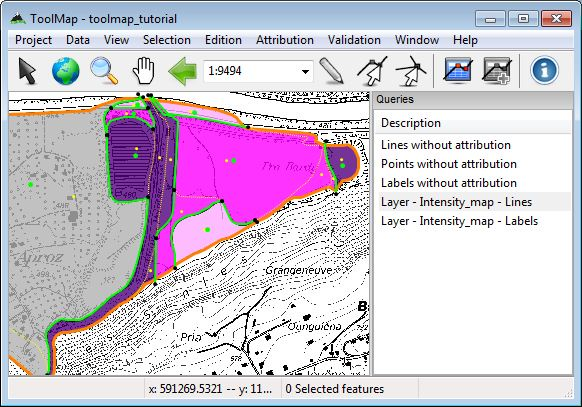
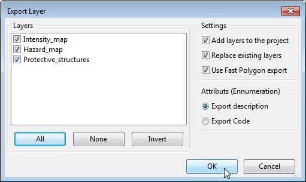
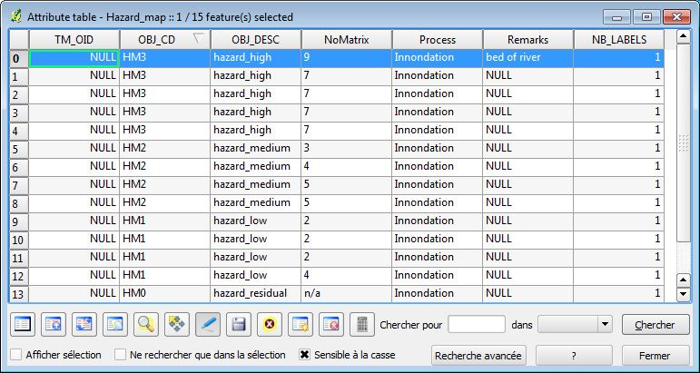

Validation
===============

After the vectorization phase comes the validation. You don't want to export layers with wrong attributions or topological errors. hopefully there are strong tools to check up your work in ToolMap.

Polygons structure
---------------------------

You have to make sure your borders of polygon delineate correctly all your surfaces. If they don't you will have problems at the export.

:menuselection:`Validation --> Dangling nodes --> Intensity_map` (see :ref:`dangling-nodes`)

If the tool finds dangling nodes it means that at least one surface is badly closed. If it is the case, correct your error either by snapping the lines properly or attributing them adequately.

Reiterate this operation for the Hazard_map layer as well.

Attribution
---------------------------

Sadly ToolMap can't yet prevent the human factor. So if you misattributed a feature, it won't be automatically corrected. To identify those mistakes use the queries. Using the query wizard create a query for every object.

:menuselection:`Validation --> New query...` (see :ref:`semantic-validation`)

The queries can be used to apply a different symbology on two groups of features. Use this option to sort your data and eventually discover mistakes.

:menuselection:`right-click on a query --> Use Query for symbology`

or

:menuselection:`right-click on current layer --> Symbology... --> Multiple symbology`

The figure above show the Map with highlighted features of the Intensity_map layer

Export
---------------------------

At this stage the only thing left to do is to export your layers. You will need to define the export path of your project for that.

:menuselection:`Project --> Edit --> Settings... --> Export path` (see :ref:`proj_manage#settings`)

Set the export path, you can use the folder **"03 - Export"**. You are now ready to export your layers.

:menuselection:`Project --> Export layer... (Ctrl+Alt+E) --> All --> Ok` (see :ref:`proj_manage#export-a-project`)

You can now use your shapefiles in other softwares. See below the attribute table of my Hazard_map shapefile in Qgis for exemple:

Thanks
---------------------------

Thank you for following this tutorial, we hope it provided you the help you needed to start with ToolMap. Find out more advanced tips on the :ref:`tips` page.

