Vectorization
======================

The digitizing process goes through the vectorization of the following layers:

  * Frame (line)
  * Points (point)
  * Lines (line)
  * Labels (point)

Those layers are displayed in bold in the :ref:`table-of-content`.

Getting ready
--------------------------------

Link data
^^^^^^^^^^^^^^^^^^^^^^^^^^^^^

Your project is now opened, but you will need some support themes as reference and base of vectorization.

:menuselection:`Data --> Link data... (Ctrl+O)` (see :ref:`link-data`).

Navigate to *ToolMap* > *02 - data*, select all the files and click on :guilabel:`Open`. The linked files now appear in the table of content.

Activate snapping
^^^^^^^^^^^^^^^^^^^^^^^^^^^^^

The snapping option allows you to be certain two vertices are indeed at the exact same location.

:menuselection:`Edition --> Snapping --> Snapping panel... (Ctrl+G)` (see :ref:`snapping-panel`)

By right-clicking on the panel display the contextual menu allowing you to add a new layer to be considered for the snapping. Display the layers **Lines** and **Frame**

Set the tolerance to 6 (depending your preferences and at which scale you are working you may want to increase/decrease this value).

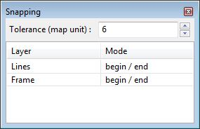

Draw the frame
^^^^^^^^^^^^^^^^^^^^^^^^^^^^^

Now that the snapping is set, define the area of study by drawing the frame.

:menuselection:`Right-click on Frame --> Edit layer` (see :ref:`edition-tools`)

The layer is now underlined in the table of content meaning it is in edition. By selecting the draw tool start vectorizing the frame.

:menuselection:`Edition --> Draw feature (D)` (see :ref:`draw-feature`)

Draw the frame by creating vertices all around the desired zone. Once at the end, put your last vertex a bit on the side and validate the frame with the :guilabel:`Enter` or :guilabel:`Tab` key. The vectorized line may not be very visible, to solve this little issue change the symbology of the frame.

:menuselection:`Right-click on frame --> Symbology` (see :ref:`symbology`)

Change the color for orange (or any visible color) and set the width to 3.

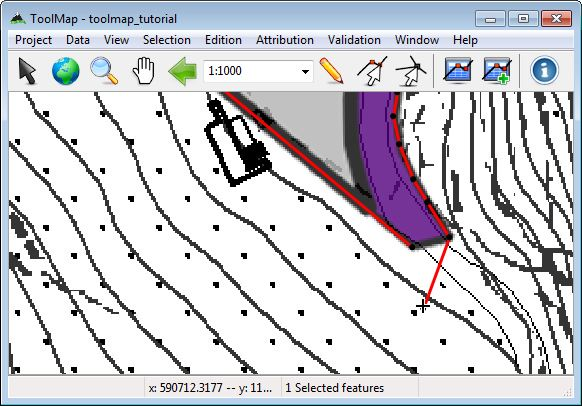

You now have to close properly your frame:

:menuselection:`Edition --> Modify feature (M)` (see :ref:`modify-feature`)

Click on the last vertex and drag it near the first vertex, if the snapping is set correctly it shall be attracted to it ensuring the geometrical validity (vertex displayed in green if it is the case). Finish the modification by clicking on the :guilabel:`Enter` key.

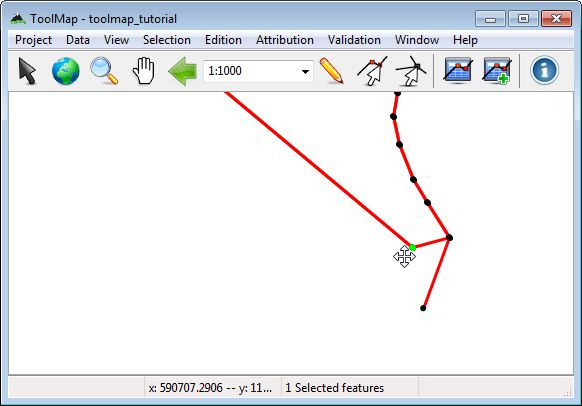

.. _drawing-the-lines:

Drawing the lines
--------------------------------

Settings
^^^^^^^^^^^^^^^^^^^^^^^^^^^^^

There are some few things to set before truly starting to vectorize the lines:

  * :menuselection:`Right-click on Lines --> Symbology`.  Set the color to a nice flashy green and the width at 2.

  * :menuselection:`Right-click on Lines --> Show vertex --> begin/end`. This will display the vertices on both sides of every line. This will help a lot to know where you will be able to snap your lines.

  * :menuselection:`Attribution --> Object kind...` (see :ref:`object-kind`). Open the Object kind panel where all the objects of the project are listed and sorted by layer type.

  * Uncheck all the support files but "Intensity_map" in the table of content. You will use the others after finishing the vectorization of this map.

Edition/Attribution
^^^^^^^^^^^^^^^^^^^^^^^^^^^^^

The line creation is a 3 steps process:

  - Vectorization
  - Object definition
  - Object attribution (if available)

Remember that every segment of line can be attributed differently depending upon the other levels of information. So every time you encounter an intersection you will have to undergo the 3 steps process.

Like we did for the frame, we have to enter the edition mode on the **Lines** layer this time.

:menuselection:`Right-click on Lines --> Edit layer`

1. :menuselection:`Edition --> Draw feature (D)`

Draw your first line until you find an intersection. Validate it by clicking on the :guilabel:`Enter` key. For the lines starting/ending at the frame don't be afraid to draw them out of it. They will be cut on the export anyway.

.. image:: img/tuto-vectorization-line1.png

The created line is automatically selected after validation. By default the selected lines appear in red, all their vertices are also visible. When editing the **Lines** layer the line objects are automatically displayed in the Object kind panel.

2. :menuselection:`Check Border of Intensity_map --> press Add button`

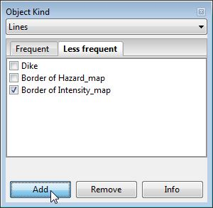

3. :menuselection:`Attribution --> Object attribute (single feature)... (Ctrl+A)` (see :ref:`object-attribute`)

Nothing happens, your object "Border of Intensity_map" is a line delineating a polygon. It has consequently no attributes.

The 3 steps process is now finished, reiterate it for the rest of the lines. The frame act as a border of polygons, so don't bother vectorizing lines on it to close your polygons. Finally your project should start to look like the following:

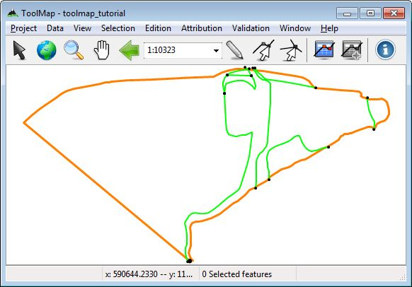

.. _drawing-the-labels:

Drawing the labels
--------------------------------

At this stage the lines delineating the borders of the polygons of the intensity_map layer are drawn. But they are actually only empty surfaces. To give them their descriptive object and attributes you have to edit the labels. The process is similar to the lines but somehow more simple.

Settings
^^^^^^^^^^^^^^^^^^^^^^^^^^^^^

:menuselection:`Right-click on Labels --> Symbology...`

Set the color a nice light blue and the radius at 8

Edition/attribution
^^^^^^^^^^^^^^^^^^^^^^^^^^^^^

:menuselection:`Right-click on Labels --> Edit layer`

The labels don't have any topological meaning. It is why the exact location of your labels is not important. The relevant thing is to have one label laying within the borders of every polygonal surface you want to digitize.

1. :menuselection:`Edition --> Draw feature (D)`

As the labels are point type geometries it is quiet easy to draw them. Click on the wanted location and the label is already created. There is no need to press a finalizing key like for the lines. Once it is created it is automatically selected and ready to be attributed.

2. :menuselection:`Check appropriate object --> Add`

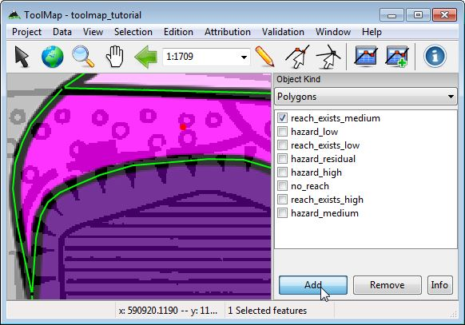

3. :menuselection:`Attribution --> Object attribute (single feature)... (Ctrl+A)`

The Object attribute (single feature) window pops up. Set process to innondation, recurrence_age to 300 and you have the liberty to write a comment if you desire.

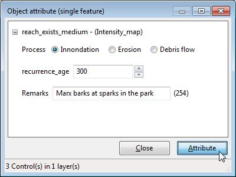

Reiterate the process as many time as needed to put one label in every surface appearing on your Intensity_map. You should slowly get to a map such as this one:

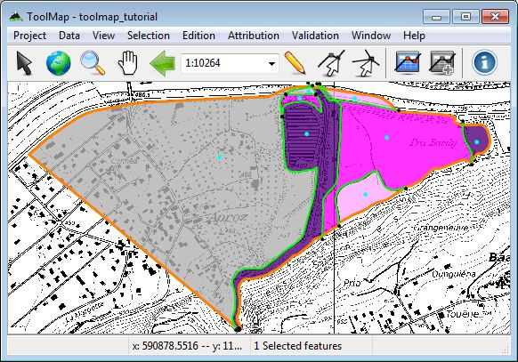

.. tip:: The vectorization/attribution of labels and points are exactly the same

Move from one support to another
--------------------------------

Until now you went through the vectorization of one support theme but there is still plenty information to digitize. Change the display of the support themes. move from Intensity_map to Hazard_map.

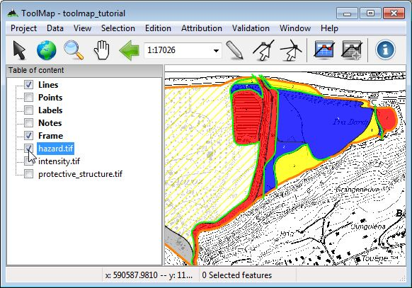

As you can see on the picture above, a lot of structures are actually redundancies of what you already vectorized. The lines consistent with the new support theme have to be attributed as part of this layer.

:menuselection:`Right-click on Lines --> Edit layer`

:menuselection:`Edition --> Select feature (V) --> Add new attribution`

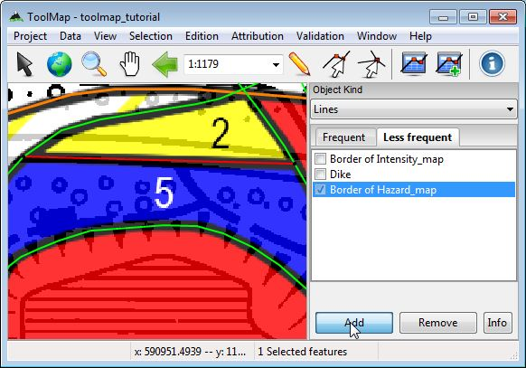

Once you have attributed the existing lines, you have to draw and attribute the rest of them. On this map there are new intersections. For that purpose create them by cutting the existing lines. The tool cut line allows you to cut a line on an existing vertex. The cutted line will be divided at the location of the vertex.
If there isn't a vertex at the desired location, you can easily add one with the insert vertex tool.

*Optional*: :menuselection:`Select a line --> Edition --> Insert vertex (I)` (see :ref:`insert-vertex`)

:menuselection:`Select a line --> Edition --> Cut line (Ctrl+X)` (see :ref:`cut-line`)

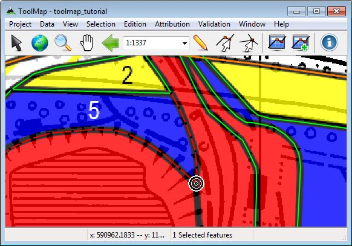

When you are finished with the vectorization/attribution of the lines, reiterate the operations of the chapter :ref:`drawing-the-labels`. At the end you shall have something looking like this:

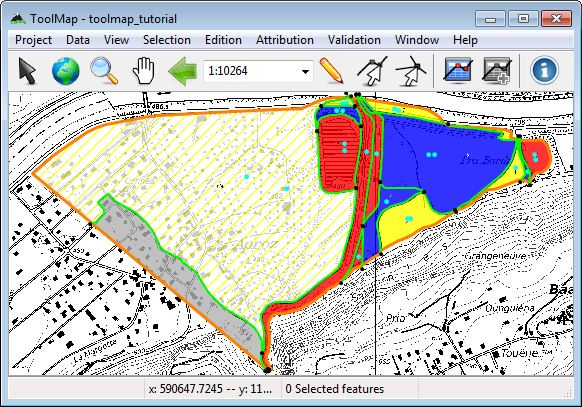

Move on
--------------------------------

There is still the last layer to vectorize and attribute, the instability structures. As it is a line layer you just have to follow the process of the chapter :ref:`drawing-the-lines`.

.. hint:: No vectorization should be required ;)

.. note:: In this exemple each support theme represent a different layer. It is however possible to have more complex maps with more information on it. The processes remain the same you just have to mix them.
