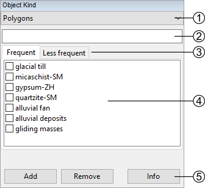
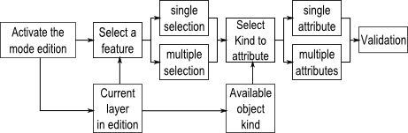
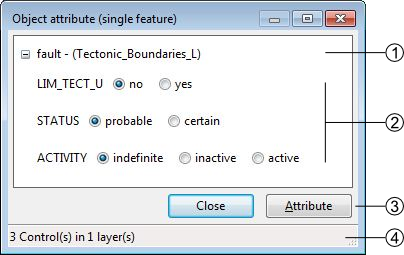
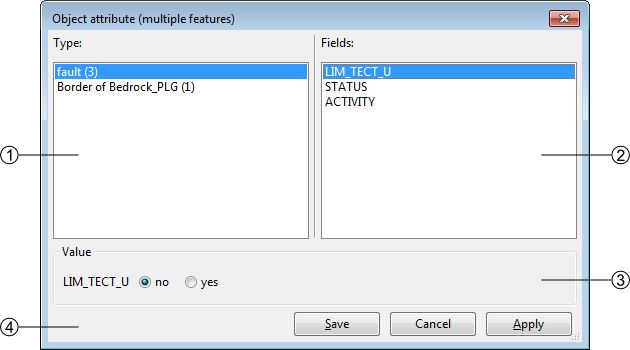
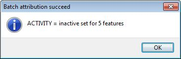
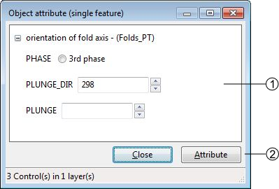
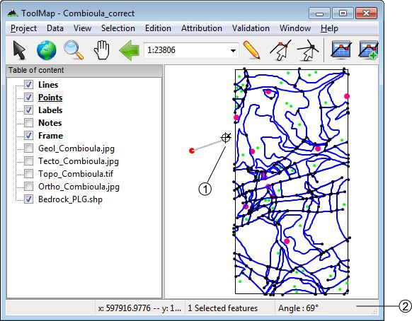
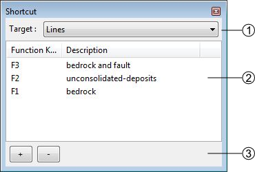
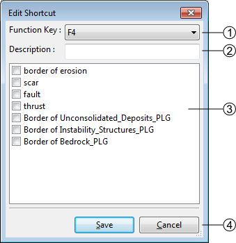
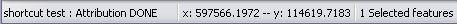

Attribution
====================

The attribution function allows assigning descriptive properties to the selected feature or group of features. The descriptive properties of an object are defined by the following elements:

  * The object kind
  * The attributes bounded to the layer of the object

The access to the attribution functions is made with the menu :guilabel:`Attribution`

  * Object Kind
  * Object Attribute (single feature)... (:kbd:`Ctrl+A`)
  * Object Attribute (multiple features)... (:kbd:`Ctrl+Alt+A`)
  * Object Kind Panel
  * Orientation (interactive mode) (:kbd:`Ctrl+Y`)
  * Shortcut...

.. _object-kind:

Object kind
----------------------------

This level of attribution is made with the object kind panel. This panel can be activated with the :menuselection:`Attribution --> object kind...` menu or by clicking on the Object Kind button in the toolbar.

#. The current construction layer in edition
#. The list of objects related to the construction layer defined in (1). This list can be reordered using a contextual menu. In the line layer the objects are distributed in two categories:

    * Frequent objects
    * Less frequent objects. The assignation of the object kinds to one or the other category is made at the level of the object kind definition (cf: [[man:proj_manage#edit_objects|Edit object]]).

#. Object kind controls:

    * The [Add] button allows you to add one or more object kind. It will only adjoin the selected new object(s) to the selected features without removing their previous attribution.
    * The [Remove] button allows to remove one or more object kind. It will only disjoin the selected object(s) from the selected features.
    * The [Info] button allows displaying the kinds attributed to the selected feature (enable only for a single selection).

*Object kind attribution scheme*

.. _object-attribute:

Object attribute
----------------------------

Some layers have linked attributes, which describe the related objects. The attributes can be assigned with the Object attribute (single feature) window. This window can only be displayed when selecting an unique object. It is available through the :menuselection:`Attribution --> Object Attribute (single feature)...` menu or by clicking on the Object Attribute button in the toolbar.

#. Name of the Layer
#. Attributes
#. Save or Cancel the modifications
#. Number of attributes available

.. _object-attribute-batch:

Object attribute batch
----------------------------

The  menu :menuselection:`Attribution --> Object attribute(multiple features)...` allows you to assign a same attribute to all the selected features having the same object kind:

#. List of the objects kind corresponding to the selected features, the value in bracket indicates the number of selected features corresponding to the same kind.
#. List of the attributes corresponding to the layer of the selected object kind
#. Value of the selected attribute, the value can be a text, an integer, a float, a date or an enumeration type (in this case: a text). There you can assign the new value to all the selected and concerned features. Only one attribute can be edited at once, apply your modification before making another changes.
#. Attribution batch controls:

    * [Save]: save the modifications and close the window
    * [Cancel]: cancel the modifications and close the window
    * [Apply]: apply the modifications without closing the window, a message appears to confirm the succeed of the operation.

Object Kind Panel
----------------------------

The :guilabel:`object Kind Panel` from the menu Attribution allows you to activate three options if checked:

  - Full attribution: immediately open the advanced attribution window after the basic attribution of an object
  - Empty list after attribution: automatically clear all the object kind previously selected after the attribution
  - Auto display attributes: automatically display the attributes when selecting an object

Attribute orientation to point
--------------------------------

In the case where the object can be oriented, you can give a feature an orientation. You have two ways to do it:

  * From the Object attribute window, just enter the value in the proper attribute.

#. Some text attributes (the number in bracket is the maximal number of characters, this number is defined in the attributes properties)
#. The orientation attribute
#. Attribution controls
#. Number of attributes available

  * With the menu :menuselection:`Tools --> Set orientation (interactive mode)`, your cursor also change and you will be able to assign an orientation with a click-and-release action.

#. The orientation cursor
#. The orientation indicator

Once you have release the click, the value of the orientation indicator is attributed to the feature.

.. important:: If you don't drag your cursor enough, an error message will pops up telling you that there isn't enough data to compute the orientation

Shortcuts
----------------------------

The :guilabel:`Shortcut...` option of the attribution menu allows to assign shortcuts to facilitate the attribution.

#. Drop-down menu allowing to select the construction layer where the shortcuts are assigned.
#. List of the shortcuts and descriptions. Following operations can be realized in the list:

    * Edit the shortcuts characteristics by double-clicking on it
    * Reorganize the list of shortcuts with the contextual menu by right-clicking

#. List of shortcuts management controls

    * [+]: add a shortcut
    * [-]: delete a shortcut. The suppression can also be made with the :kbd:`DELETE` or :kbd:`BACKSPACE` keys.

The shortcuts edition window looks like the following:

#. List of key functions available which can be assigned to a shortcut
#. Description of the shortcut
#. Object kind associated to the shortcut, the shortcut can attribute more than one object
#. Apply or Cancel the modifications

At the attribution with a shortcut, you have a message in the status bar that confirms the attribution.

