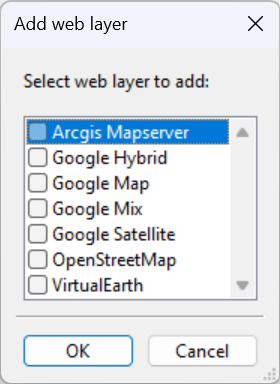

Spatial Data management
=======================

The data management is made through the :guilabel:`Data` menu, it contains the following elements:

  * :guilabel:`Link data...` (:kbd:`Ctrl+O`): reference a support layer which will be displayed in your project
  * :guilabel:`Unlink data...` (:kbd:`Ctrl+W`): unlink a layer
  * :guilabel:`Add Web data...` (:kbd:`Ctrl+Alt+W`): Add web data such as Google / Bing images
  * :guilabel:`Import data`: import data into one of your construction theme

.. _link-data:

Link data
-----------------

The :menuselection:`Data --> Link Data...` option allows loading some support themes for the vectorization of the construction layers. Those support themes can be vector data (\*.shp) or raster data (\*.tif, \*.JPG and Esri's binary GRID).

In the opposite of the construction layers, the support themes are not stocked in the project but only referenced.

Rotation
^^^^^^^^^^^^^^^^^^^^^

Some of your files may have rotation information, which is not yet supported by ToolMap. In that case you will see the following message:

.. image:: img/window-rotationwarning.png

#. rotation information
#. display option

This message will pop up every time you make an action regarding the layer (including trivial actions like zoom or pan), so be sure to convert your images into non-rotated rasters (see :ref:`rotation_warning`). If the rotation is insignificant, you may prefer to simply ignore the message by checking the option **Hide warnings for this layer**. This option prevent the appearance of the message for the current session, but it will pop again the next time you launch your project.

Unlink data
-----------------
The :menuselection:`Data --> Unlink data` option allows removing specified support layers from the project. Those layers aren't deleted but simply removed from the project.

.. image:: img/unlink-data.png

Add Web Data
-----------------

The :menuselection:`Data --> Add Web data` option allows adding web data as support layers. The list of supported web data are listed in the picture bellow.

.. note:: Web data layers will not be displayed if there is no data into the actual project. Web layers aren’t able to know which part of the world should be displayed if at least one local support layer or one construction layer isn’t displayed.

.. warning:: Currently, web data layers didn’t work behind a proxy. This will be improved in futures versions

Import data
-----------------

The :menuselection:`Data --> Import data...` option allows to import some existing information into the construction layers. You can only import lines or points geometries. The process is made in several successive steps. The import might finish earlier if the next steps are not relevant (e.g. there is no attribute).

.. _datamanagement#Step1:

Step 1
^^^^^^^^^^^^^^^^^^^^^

ToolMap supports the import of csv (points only) or shapefiles (points, lines, frame, or labels)

.. image:: img/window-importdata1.png

#. The file type option allows two types of data, choose the one you want to import
#. Go to the next step or cancel the operation

.. _datamanagement#Step2:

Step 2
^^^^^^^^^^^^^^^^^^^^^

If you choose to add a shapefile the following step comes ahead

.. image:: img/window-importdata2.png

#. Path to the shapefile
#. Information about the shapefile
#. Go back to :ref:`datamanagement#Step1` or continue to :ref:`datamanagement#Step4`

If you choose to add a CSV file, the following step comes ahead

.. image:: img/window-importdata4.png

#. Path to the CSV file
#. Information about the CSV file
#. Go back to :ref:`datamanagement#Step1` or continue to :ref:`datamanagement#Step3`

.. _datamanagement#Step3:

Step 3 - for CSV files only
^^^^^^^^^^^^^^^^^^^^^

The CSV files are composed of columns of data separated with commas. The columns containing the X and Y coordinates must then be selected.

.. image:: img/window-importdata5.png

#. List of the columns which can be assigned as X or Y coordinates. If the fields have standard names, they can be automatically preselected.
#. Go back to :ref:`datamanagement#Step2` or continue to :ref:`datamanagement#Step4`

.. _datamanagement#Step4:

Step 4
^^^^^^^^^^^^^^^^^^^^^

Select the target to import the data.

.. image:: img/window-importdata3.png

#. List of possible targets to import the data
#. Go back to :ref:`datamanagement#Step3` or continue to :ref:`datamanagement#Step5`

.. _datamanagement#Step5:

Step 5
^^^^^^^^^^^^^^^^^^^^^

Select the layer to import the data (if not a frame).

.. image:: img/window-importdata6.png

#. List of possible layers to import the data
#. Go back to :ref:`datamanagement#Step4` or continue to :ref:`datamanagement#Step6`

.. _datamanagement#Step6:

Step 6
^^^^^^^^^^^^^^^^^^^^^

Select the object kind field.

.. image:: img/window-importdata7.png

#. Select which field in the file contains the definition of the object kind.
#. Alternatively, select a single kind for all objects.
#. Go back to :ref:`datamanagement#Step5` or to continue to :ref:`datamanagement#Step7`

.. _datamanagement#Step7:

Step 7
^^^^^^^^^^^^^^^^^^^^^

Define the matching of the object kinds with the database.

.. image:: img/window-importdata8.png

#. All values of the field identified as object kind are listed. On the right-hand side, a list of all object kinds from the database is displayed. The correspondence must be established.
#. Go back to :ref:`datamanagement#Step6` or to continue to :ref:`datamanagement#Step8`

.. _datamanagement#Step8:

Step 8
^^^^^^^^^^^^^^^^^^^^^

Define the matching of the attributes with the database (if applicable).

.. image:: img/window-importdata9.png

#. All other fields of the file are listed. On the right-hand side, a list of all attributes from the database is displayed. The correspondence must be established.
#. Go back to :ref:`datamanagement#Step7` or to continue to :ref:`datamanagement#Step9`

.. _datamanagement#Step9:

Step 9
^^^^^^^^^^^^^^^^^^^^^

Define the matching of the enumerations with the database (if applicable).

.. image:: img/window-importdata10.png

#. All attributes that are of enumeration type are listed. The first attribute name is the one from the database and the second is the one from the file.
#. All the field values from the file for that attribute are listed. On the right-hand side, a list of all enumeration values for that attribute from the database is displayed. The correspondence must be established.
#. Go back to :ref:`datamanagement#Step8` or to terminate the import.

Table of contents options
---------------------------

.. image:: img/window-tocoption.png

#. |img1| Activate the display of the layer |img2| Deactivate the display of the layer
#. Edition mode activated: the layer is underlined

contextual menu
^^^^^^^^^^^^^^^^^^^^^

The contextual menus are opened by right-clicking on a layer of the table of contents. They vary according to the selected layer.

Construction

.. image:: img/pdm-toc.png

Support

.. image:: img/pdm-toc2.png

* Name of the layer
* Edit this layer (construction layers only)
* Remove layer (support themes only)
* Move the selected layer in the table of contents

.. image:: img/pdm-tocmove.png

* Display management of the vertex (line and polygon layers type only)
* Symbology management. This option can also be activated by double-clicking on the layer. (see :ref:`symbology`)

.. |img1| image:: img/button-marked.png
.. |img2| image:: img/button-unmarked.png

