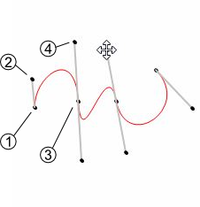
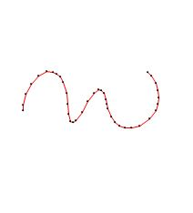
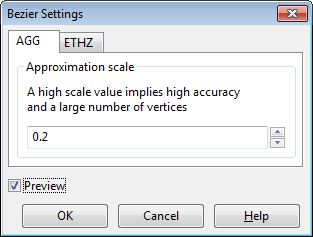
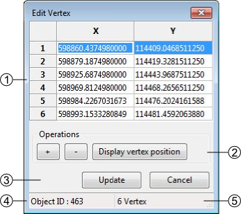
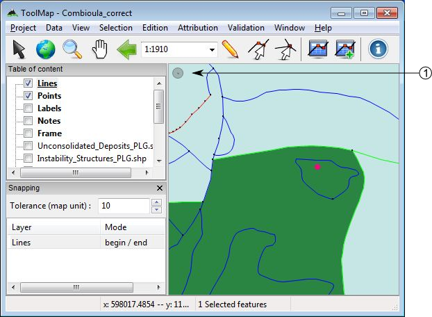

Edition
=========

All the edition tools are regrouped in the menu :guilabel:`Edition`, which contains the following elements:

  * Draw :kbd:`D`
  * Modify feature :kbd:`M`
  * Draw Bezier :kbd:`P`
  * Modify Bezier :kbd:`A`
  * Bezier Settings
  * Remove last vertex :kbd:`Ctrl+Z`
  * Edit vertex :kbd:`Ctrl+V`
  * Insert Vertex :kbd:`I`
  * Delete Vertex :kbd:`C`
  * Move shared node :kbd:`Ctrl+T`
  * Delete feature :kbd:`Delete`
  * Cut line :kbd:`Ctrl+X`
  * Merge lines :kbd:`Ctrl+F`
  * Create interection :kbd:`Ctrl+I`
  * Flip line :kbd:`Ctrl+Alt+F`
  * Snapping

.. _edition-tools:

Edition tools
--------------------

To edit objects with the different tools in ToolMap you will have to enter the edition mode.

  * Select the layer to edit in the table of contents
  * Activate the Edit Layer option in the pull-down menu

This operation activate the edition menu

.. important:: Only the construction layers (displayed in bold in the table of content) can be edited. You can only edit one layer at once

.. _draw-feature:

Draw feature
^^^^^^^^^^^^^^^^^^^^^^^^^^^^

The draw tool allows creating new features

Point type layer
""""""""""""""""""""""""""""

  * Activate the tool, the edition cursor displays
  * Vectorize the point with a left click

Line type layer
""""""""""""""""""""""""""""

  * Activate the tool, the edition cursor displays
  * Vectorize the line with the mouse, each left-click creates a vertex
  * Cancel the last vertex of the segment in edition; :menuselection:`Edition --> Remove last vertex` ( :kbd:`Ctrl+Z`)
  * Finish the construction of the object with the :kbd:`ENTER` or :kbd:`TAB` key
  * Cancel the segment in creation with the :kbd:`ESC` key

.. _modify-feature:

Modify feature
^^^^^^^^^^^^^^^^^^^^^^^^^^^^

The :guilabel:`modify` option allows modifying features.

Point type layer
""""""""""""""""""""""""""""

  * Select a point
  * Activate the tool ; the modification cursor displays
  * Modify the position of your selected point by dragging it with your cursor

Line type layer
""""""""""""""""""""""""""""

  * Select a line
  * Activate the tool ; the modification cursor displays
  * Modify the vertex position with the cursor by dragging it
  * Cancel the modification of the current segment with the :kbd:`ESC` key
  * Apply the modifications with the :kbd:`ENTER` or :kbd:`TAB` keys

Draw Bezier
^^^^^^^^^^^^^^^^^^^^^^^^^^^^

The draw Bezier tool allows building Bezier curves. For each section of Bezier you’ll have to click four time (see below).

#. Defines your starting point
#. Defines the direction of your Bezier at the starting point
#. Defines your arriving point
#. Defines the direction of your Bezier at your arriving point

Modify Bezier
^^^^^^^^^^^^^^^^^^^^^^^^^^^^

While drawing your Bezier curves, you can modify them using the option :guilabel:`Modify Bezier`. This option allows you to move your starting/arriving points also the orientation and intensity of the way.

.. warning:: Your Bezier curve can only be edited while drawing. Once you validate it, it becomes regular segments of line and can therefor only be edited as such.

Bezier Settings
^^^^^^^^^^^^^^^^^^^^^^^^^^^^

In the Bezier settings you can manage the parameters of the Bezier. You have access to two styles of parameters:

#. The AGG fashion: Have only one parameter, the higher your value the more complex your curve (more vertices).
#. The ETHZ fashion: With the ETHZ method you can play on two parameters; the maximum number of points for each segment and the width tolerance. While the maximum number is easy to understand the width range defines whether a vertex is created or not, the higher the range, the more simple your curve.

The :guilabel:`Preview` option displays how the line will be created regarding the parameters. It is only available while drawing a Bezier.

.. note:: The Bezier settings are specific to the project, the configuration remains even if you close and re-open the project

Remove last vertex
^^^^^^^^^^^^^^^^^^^^^^^^^^^^

While drawing a line or a Bezier, this tool allows you to remove your last vertices. This tool works only during the vectorization process. This tool will not remove vertices from a validated line.

.. _edit_vertex:

Edit Vertex
^^^^^^^^^^^^^^^^^^^^^^^^^^^^

Allows modifying the geographical coordinates of the vertices.

  * Select a feature
  * activate the tool ; The following window pops up

#. Geographical coordinates of the vertices defining the geometry of the feature
#. The coordinates can be directly edited in the table.

    * [+]: add a new Vertex, the insertion is made after the current selection. The X,Y coordinates have to be edited. The insertion of a vertex without coordinates provokes an error message at the update of the geometry.
    * [-]: suppression of the selected vertex.
    * [Display Vertex]: Visualization of the selected vertex.

#. Update or cancel the current modifications
#. Selected feature ID
#. Number of vertices of the selected feature

.. _insert-vertex:

Insert vertex
^^^^^^^^^^^^^^^^^^^^^^^^^^^^

This tool allows you to insert vertices on a selected line. To do so activate the tool with the option :guilabel:`insert vertex` in the edition menu or with the :kbd:`I` shortcut and simply click on your selected line where you want an additional vertex.

Delete vertex
^^^^^^^^^^^^^^^^^^^^^^^^^^^^

The Delete vertex tool allows you to delete any vertices on a selected line. To do so simply activate the tool selecting the option :guilabel:`delete vertex` in the Edition menu or with the :kbd:`C` shortcut and aim for an unwanted vertex, it will be obliterated.

Move shared node
^^^^^^^^^^^^^^^^^^^^^^^^^^^^

The :guilabel:`Move shared Node` allows to move a vertex which is assigned to more than one line. The point is to move a vertex by keeping the boundaries of every lines related to it. This tool is activated using the menu :menuselection:`Edition --> Move shared node` (:kbd:`Ctrl+T`) or using the corresponding button in the toolbar.

Delete selected feature
^^^^^^^^^^^^^^^^^^^^^^^^^^^^

allows deleting the selected features

  * Select the feature(s)
  * Use the option :menuselection:`Edit --> Delete selected feature` of the  menu or use the :kbd:`Delete` or :kbd:`Backspace` key

In the case of a multiple selection, a window appears asking a confirmation of the suppression.

.. _cut-line:

Cut line
^^^^^^^^^^^^^^^^^^^^^^^^^^^^
The :guilabel:`cut lines` option allows cutting lines. The cut can only be done on a vertex.

  * Select a line
  * Activate the tool with the menu or with the shortcut (:kbd:`Ctrl+X`) ; the tool cursor displays
  * click on the vertex where the division must be done

The two lines will then have the attributes of the original line.

Merge Line
^^^^^^^^^^^^^^^^^^^^^^^^^^^^

Allows merging the selected lines. The selected lines have to be adjacent, the lines must have a begin/end vertex in common.

#. Select lines
#. Activate the tool : several cases are possible:

    - Same attributes =>no consequences
    - Different attributes => the user has to define the attributes to keep
    - 1 non attributed object => the user has to define the attributes to keep
    - Same polarity => no consequences
    - Different polarities => the polarity becomes left to right

.. _create-intersection:

Create intersection
^^^^^^^^^^^^^^^^^^^^^^^^^^^^

Allows creating intersections between lines which cross themselves. All the segments created will keep their previous attributes

  * Select a line which cross another one.
  * Activate the tool with the menu or with the :kbd:`Ctrl+I` shortcut.

.. important:: The tool will generate very small lines if they cross themselves on a vertex

Flip fline
^^^^^^^^^^^^^^^^^^^^^^^^^^^^

The :guilabel:`Flip line` option allows to reverse the polarity of the selected line. To check the polarity of the line you have to either open the vertex editor (see :ref:`edit_vertex`) and check the coordinates of the first vertex or use the oriented line symbology (see :ref:`visualization#lines`) . The tool can be used on multiple lines at once.

snapping
--------------------

The snapping tools are accessible via the menu :menuselection:`Edition --> Snapping`

During the vectorization of a point or line feature, the snapping function allows to hang on the nodes of an existing feature. The snapping can be done on the features of the active layer (i.e. current edition) and/or on features belonging to other layers (construction layers and vectorial support themes)

.. _snapping-panel:

Snapping panel
^^^^^^^^^^^^^^^^^^^^^^^^^^^^

The :guilabel:`snapping panel` (:kbd:`Ctrl+G`) is defined by the following elements:

.. image:: img/window-snapping.png

#. The capture tolerance of nodes
#. The involved layers
#. The mode of snapping used for the involved layerlayer. You can choose between :

    * None: the snapping is disabled on this layer.
    * Begin/end: the snapping occure only on the first and last vertices of a line.
    * All vertex: the snapping occure wherever there is a vertex.

Snapping display
^^^^^^^^^^^^^^^^^^^^^^^^^^^^

Using the option :guilabel:`Show snapping radius on map` (:kbd:`Ctrl+Alt+G`); you will display a circle in the top left corner of the visualization window representing the snapping tolerence.

#. Snapping tolerance

The options :guilabel:`Add layer...` and :guilabel:`Remove layer...` are both accessible in the menu :menuselection:`Edition --> Snapping` or with the contextual menu of the snapping panel.

.. note:: The :kbd:`Space` or :kbd:`Shift` keys temporarily deactivate the snapping. You can use it while working in the vicinity of existing nodes to prevent undesirable snapping.