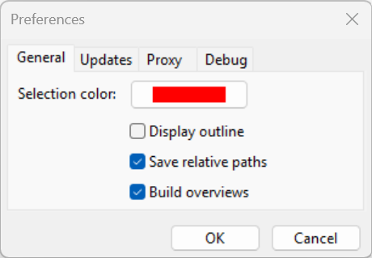

Functionalities
===================

In ToolMap you have several windows providing you some extra tools or informations. They are described below.

Preferences
------------------------------

The Preferences window is accessible through the menu :menuselection:`window --> preferences`. It contains some basic settings accessible at any time (even if no project is opened).

* Selection color: color of the selected features (red by default).
* Display outline: displays a white outline around the selected features if checked.
* Save relative paths: makes ToolMap remember the relative path and not the physical path of the linked data.
* Build overviews: allows toolmap to build overviews for the data which don't have them already. It can greatly improve the performences of ToolMap in the case of heavy data.

The second tab of the window is for updates options. If you have an access to internet ToolMap will automatically check for new updates.

* Activate/deactivate the update check

The third tab of the window is for the proxy configuration. If you are behind a proxy, you can set it here so that ToolMap can access the internet.

* Use system proxy: if checked, ToolMap will use the system proxy settings.
* Proxy informations: you can set the proxy address and port (ex: myproxy.com:8080).

The fourth tab of the window is for debugging options.

.. _information-window:

Information window
------------------------------

The information window is accessible with the menu :menuselection:`Window --> Information window`. It displays information about selected features or layer.

Feature tab
^^^^^^^^^^^^^^^^^^^^^^^^^^^^^^^

.. image:: img/window-informations.png

#. Selected feature ID
#. Features type and attributes

Right-clicking on a feature ID gives you can access to a contextual menu with the following operations:

  * Move to: center the screen on the selected feature
  * Zoom to: adjust the scale to display the selected feature on the whole screen (this option does not work for the point type layers).
  * Remove from selection: remove a feature from your selection
  * Select this feature only: unselect all the other features in your selection
  * Copy data to clipboard: copy the information of the selected feature

Layer tab
^^^^^^^^^^^^^^^^^^^^^^^^^^^^^^^

The :guilabel:`Layer` tab of the Information window displays all the information on the selected layer.

.. image:: img/window-informations2.png

Layouts
------------------------------

You can access ToolMap's different layouts using the :menuselection:`Window --> Layout` menu. These allows you to use three different kinds of windows disposition:

#. The :guilabel:`Default` layout, which is the one you get when first launching ToolMap. This is the one displayed in the User Interface Overview (see :ref:`user-interface-overview`).

#. The :guilabel:`Vertical` layout, which includes all the useful windows in a vertical display.  |img1|

#. The :guilabel:`Horizontal` layout, which includes the same windows than the :guilabel:`Vertical` layout but do so in the left border and the bottom of the display window. |img2|

.. |img1| image:: img/window-layout1.png
.. |img2| image:: img/window-layout2.png

You can freely close any of the tabs you wish using the corresponding menu or reorganize your tabs by clicking and dropping them where you want them to be. ToolMap will then remember your new custom layout and display it when you launch it.

You can switch back to one of the three base layouts anytime by simply selecting them again in the :guilabel:`Window` menu.

Statistics
------------------------------

The statistics window is accessible with the menu :menuselection:`Tools --> Statistics...`. It allows you when launched to count some of your editing activities.

.. image:: img/window-statistics.png

#. Statistics of the current session, it displays the number of clicks made in the visualization window, the number of attribution and intersection you made (i.e. the number of time you used the function intersection or attribution, if you attribute five objects at once it is considered as one)
#. The sum of all the statistics you made on this project
#. Statistics management: allow you to start or stop a statistic session. Clicking on start or stop immediately close the window.
#. The export option isn't available yet.
