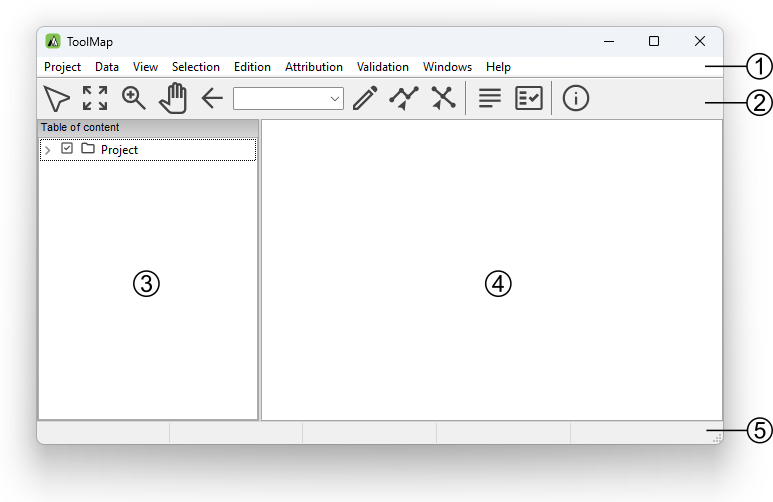
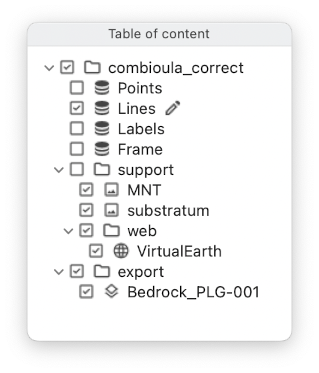

.. _user-interface-overview:

User Interface Overview
=======================

The ToolMap user interface integrates the following elements:

#. Menu bar
#. Toolbar
#. Table of content
#. Visualization and editing window
#. Status bar

Menu bar
-------------------------------

In the menu bar nine menus are available, each of them will lead you to different options:

  - :guilabel:`Project`: This menu contains all options related to the project management.
  - :guilabel:`Data`: This menu allows the user to add or import support data into the project.
  - :guilabel:`View`: The view menu contains all options for navigating and zooming into the displayed data.
  - :guilabel:`Selection`: This menu contains tools for managing the selection.
  - :guilabel:`Edition`: All tools related to the editing process are located into this menu.
  - :guilabel:`Attribution`: This menu contains the tools used when attributing datas.
  - :guilabel:`Validation`: This menu contains the tools used to check the objects and layers before exportation as well as the //Statistics...// tool.
  - :guilabel:`Window`: windows management and other functionalities.
  - :guilabel:`Help`: The Help Menu provides various help functions as well as options for reporting a bug.

Toolbar
-------------------------------

The toolbar is accessible on top of the application window, right under the menu bar. It allows to quickly access to the different main tools available in ToolMap. Most of the toolbar buttons are grayed out while no project is open.

Selection tool
^^^^^^^^^^^^^^^^^^^^^^^^^^

  * |image_reference| Select one or several geometrical objects

.. |image_reference| image:: img/tool-selection.jpg

Navigation tools
^^^^^^^^^^^^^^^^^^^^^^^^^^

  * |img1| Zoom to the maximum extent of all visible layers
  * |img2| Zoom in or out into the visualization window
  * |img3| Pan the view in any direction
  * |img4| Go back to the previous zoom extent

Edition tool
^^^^^^^^^^^^^^^^^^^^^^^^^^

  * |img5| Draw a new object
  * |img6| Modify an existing object
  * |img7| Modify shared node

Attribution tools
^^^^^^^^^^^^^^^^^^^^^^^^^^

  * |img8| Display the Object kind panel
  * |img9| Display the Object attribute window

Information tool
^^^^^^^^^^^^^^^^^^^^^^^^^^

  * |img10| Display the identification window

Scale
^^^^^^^^^^^^^^^^^^^^^^^^^^

  * |img11| Drop-down menu of available scales. User defined scale can be set using the :menuselection:`Project --> Edit --> Settings` menu

Table of Content
-------------------------------

The table of content shows a list of all the layers loaded in the project. It looks like the following:

#. Construction layers, they are automatically generated at the creation of the project and can be edited. They are displayed using a bold font.
#. Support Themes, they cannot be edited.

Status bar
-------------------------------

The status bar at the bottom of the application window provides additional information like geographical coordinates or the number of features selected.

Keyboard shortcuts
-------------------------------

Keyboard Shortcuts have been set to the most used functions to make the use of Toolmap easier and quicker.

.. note:: Under Mac OSX, Ctrl is replaced by the standard CMD(⌘) button.

Project management
^^^^^^^^^^^^^^^^^^^^^^^^^^^^^

  * :kbd:`Ctrl+N`: Create a new empty project
  * :kbd:`Ctrl+Alt+N`: Create a new project based on a template
  * :kbd:`Ctrl+Alt+O`: Open an existing project
  * :kbd:`Ctrl+S`: Backup the project
  * :kbd:`Ctrl+Alt+S`: Save the project as a template
  * :kbd:`Ctrl+Alt+E`: Open the export layer window
  * :kbd:`Ctrl+O`: Link data
  * :kbd:`Ctrl+W`: Unlink data

Navigation tools
^^^^^^^^^^^^^^^^^^^^^^^^^^

  * :kbd:`<`: Previous zoom
  * :kbd:`Z`: Zoom tool
  * :kbd:`H`: Pan tool
  * :kbd:`Ctrl+0`: Zoom to the full extent
  * :kbd:`Ctrl+1`: Zoom to frame
  * :kbd:`Ctrl+2`: Zoom to selected layer
  * :kbd:`Ctrl+R`: Refresh display

Editor tools
^^^^^^^^^^^^^^^^^^^^^^^^^^

  * :kbd:`D`: Draw a feature
  * :kbd:`M`: Modify a feature
  * :kbd:`P`: Draw a Bezier
  * :kbd:`A`: Modify a Bezier
  * :kbd:`Ctrl+Z`: Remove the last vertex
  * :kbd:`Ctrl+V`: Display the vertex positions window
  * :kbd:`I`: Insert vertex
  * :kbd:`C`: Delete vertex
  * :kbd:`Ctrl+T`: Move a shared Node
  * :kbd:`DEL`: Delete the selected objects
  * :kbd:`Ctrl+X`: Activate the line cutter tool
  * :kbd:`Ctrl+F`: Merge the selected lines
  * :kbd:`Ctrl+I`: Create intersections
  * :kbd:`Ctrl+Alt+F`: Flip the selected line (change the orientation)
  * :kbd:`Ctrl+G`: Display the snapping panel
  * :kbd:`Ctrl+Alt+G`: Display snapping radius

  * :kbd:`V`: Selection tool
  * :kbd:`Ctrl+D`: Clear Selection

  * :kbd:`ENTER / TAB`: Finish a segment or apply the modifications
  * :kbd:`ESC`: Cancel an edition or modification

Attribute tools
^^^^^^^^^^^^^^^^^^^^^^^^^^

  * :kbd:`Ctrl+A`: Display the Object attribute window
  * :kbd:`Ctrl+Alt+A`: Display the Object attribute window (batch)
  * :kbd:`Ctrl+Y`: Set Orientation tool

Others
^^^^^^^^^^^^^^^^^^^^^^^^^^

  * :kbd:`Ctrl+L`: Display the log window
  * :kbd:`Ctrl+Alt+R`: Run the selected query
  * :kbd:`Ctrl+Alt+I`: Display the information Window

.. |img1| image:: img/tool-zoommax.jpg
.. |img2| image:: img/tool-zoom.jpg
.. |img3| image:: img/tool-pan.jpg
.. |img4| image:: img/tool-previous.jpg
.. |img5| image:: img/tool-draw.jpg
.. |img6| image:: img/tool-modification.jpg
.. |img7| image:: img/tool-modify-shared.png
.. |img8| image:: img/tool-attributionb.jpg
.. |img9| image:: img/tool-attributiona.jpg
.. |img10| image:: img/tool-info.jpg
.. |img11| image:: img/tool-scale.jpg

