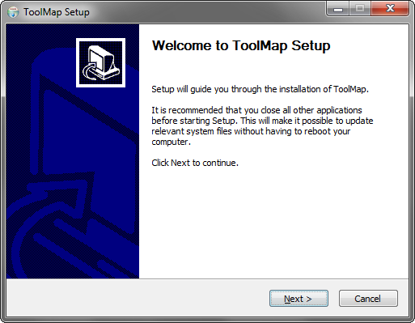
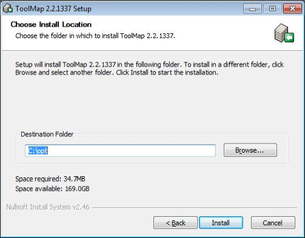
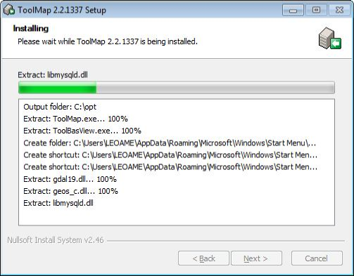
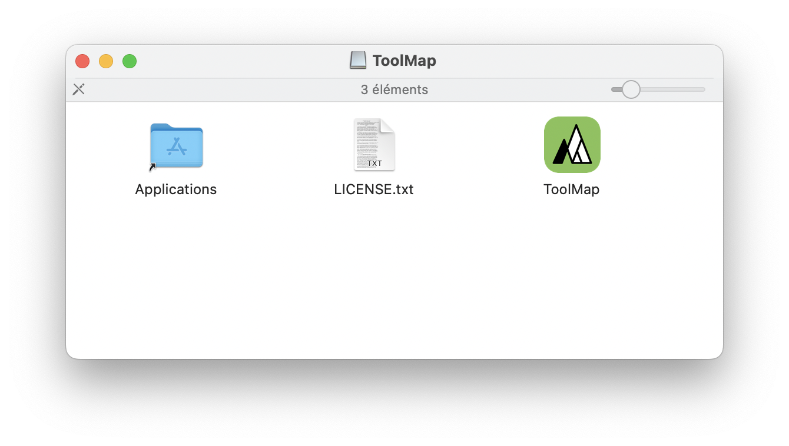
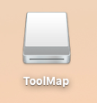

Installation
============

Windows
--------

The installation of ToolMap is rather simple. First you have to download the windows
installer. It can be found on our web site: http://www.crealp.ch/fr/accueil/thematiques/cartographie/toolmap/telechargement.html. The setup wizard will then guide you through the installation process.

Once you have activated the next step, the wizard will generate a default destination folder for the installation; you can, of course, change the destination folder.

If you click on the :guilabel:`install` button, the installation will begin. Otherwise you can go back to change settings or simply cancel the operation. If you decided to launch the installation, a progress window will pop up. The installation process should be pretty fast.

Once the installation has been completed you'll have the choice to create a desktop shortcut before closing the setup wizard.

.. image:: img/install-4.png

ToolMap can now be launched using either the desktop icon or the menu entry located in :menuselection:`Programs --> ToolMap2 --> ToolMap`

Silent Installation
^^^^^^^^^^^^^^^^^^^

ToolMap may also be installed without requiring the user to select options or click next. This mode, also called unattended installation, may be particularly useful for system administrator trying to deploy ToolMap on multiple computers without the hassle to go through all the wizard pages.

Installing
""""""""""

The following command line may be used for the silent installation of ToolMap: ::

    InstallToolMap_d967.exe /S /INSTDIR=”C:\Program Files\ToolMap2” /AllUsers

* **/S:** inform the installer to be silent

* **/INSTDIR:** Path for installing ToolMap

* **/AllUsers** (or **/CurrentUser**): Install ToolMap for all users (administrator privilege required) or for the current one only.

Uninstalling
""""""""""""

The following command line may be used for uninstalling ToolMap silently: ::

    “C:\Program File\ToolMap2\uninst.exe” /S

Mac OSX
--------

Download the ToolMap’s .DMG file from http://www.crealp.ch/fr/toolmap-telechargement.html and then double-click on it. A new Finder window similar to the one illustrated bellow should appear.

Drag the ToolMap icon into the "Applications" folder to install ToolMap. Once ToolMap is installed, you can safely eject it's disk image. Click on the ToolMap disk icon on the Desktop and then press CMD-E.

Delete the .DMG file by dragging it to the trash.

Linux
-----

ToolMap is actually only available as Debian (\*.DEB) package for Ubuntu. To install ToolMap, you may either run the following command line: ::

    sudo dpkg -i toolmap_2.4.1337_amd64.deb

or use your favorite package manager

