Project Management
===================

The whole management of the project is made with the menu :guilabel:`Project`, which includes the following options:

  * :guilabel:`New Project`: create a new project
  * :guilabel:`Open...`: open an existing project
  * :guilabel:`Recent`: open a recently used project
  * :guilabel:`Backup`: create a backup of the project
  * :guilabel:`Manage backup`: open the backup management window
  * :guilabel:`Save as Template`: save your project as a template
  * :guilabel:`Merge projects`: merge another project in the current project
  * :guilabel:`Export Layer...`: export a layer or the project as shapefile
  * :guilabel:`Export Model as PDF...`: export your data model as PDF
  * :guilabel:`Edit`: edit the project
  * :guilabel:`Exit`: quit ToolMap

.. _new-project:

New project
---------------------------

To create a new project, select :menuselection:`Project --> New Project --> Empty....` The dialog box illustrated bellow appears.

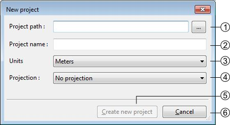

#. Project Path
#. Project name
#. Units:

    * Meters
    * Degrees (Decimal Degrees)
    * Degrees (Degrees, Minutes, Seconds)

#. Projection system:

    * Swiss projection (CH1903)
    * World (WGS84)

#. Create a new empty project and activate the next step
#. Cancel the creation of the project

.. warning:: ToolMap will not run correctly if the project isn't stored on a local disk

.. _proj_manage#generalities:

Generalities
^^^^^^^^^^^^^^^^^^^^^^^^^^

The :guilabel:`Project Properties` tab of the Project Definition window allows to complete some generic project information.

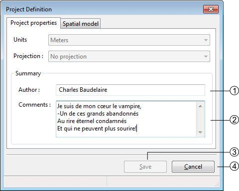

#. Define the author of the project
#. Comments about the project
#. Saves the properties modifications of the project (this button is enabled only when at least one layer is created)
#. Cancel the properties modifications of the project

.. _proj_manage#spatial_model:

Spatial model
^^^^^^^^^^^^^^^^^^^^^^^^^^

The :guilabel:`Spatial Model` tab of the Project Definition window lists the layers. Each layer contains objects and may have attributes.

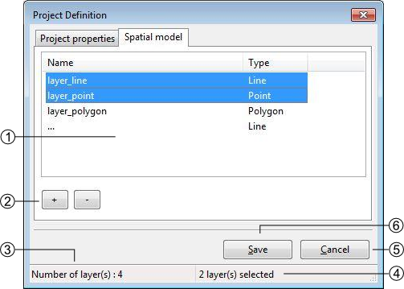

#. List of layers defining the spatial model, several operations can be realized in this list:

    * Editing the characteristics of a layer by double-clicking on it
    * Sorting layers by clicking on the list header
    * Reorganizing layers order with a contextual menu

#. Layers management controls

    * [+]: add a layer
    * [-]: delete one or several selected layer(s), the suppression can also be made with the :kbd:`DELETE / BACKSPACE` keys.

#. Number of layers
#. Number of selected layers
#. Save the project modifications (this button activate only when at least one layer is created)
#. Close the window without saving the modifications.

Layers Definition
""""""""""""""""""""""""""""

The Thematic layer definition window appears when adding a new layer:

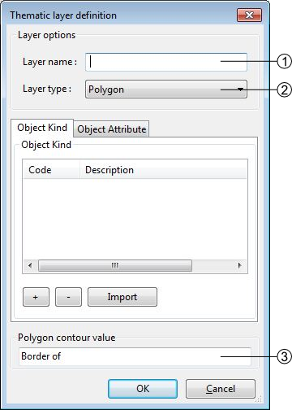

#. Layers name. This name is used as the output file name when exporting the layer.
#. Spatial layer type (line, point, polygon)
#. Name of the polygon contour. This field is only displayed for polygon layers

.. note:: The polygons in ToolMap are built with lines while the object kind is stored into a label. At the creation of the project the line related to the layer is automatically generated, but you will have to create it yourself if adding a new polygon layer on an existing project.

Object kind definition
"""""""""""""""""""""""""""""

The objects belonging to a layer are defined in the :guilabel:`Object kind` tab of the Thematic layer Definition window

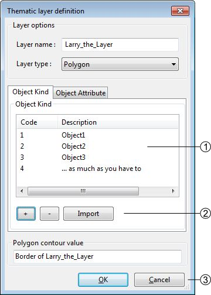

#. List of defined objects. Following operations can be realized in the list:

    * Sorting objects by clicking on the list header
    * Editing the objects characteristics by double-clicking on an object
    * Reorganizing objects order with a contextual menu

#. Objects management controls

    * [+]: Add an object |img1|

        a. Code (numerical value) duplicates are allowed but not recommended. This code will be exported as OBJ_CD field when the layer is exported
        b. Description: a textual description of the object. This value will be exported as OBJ_DESC field when the layer is exported

    * [-]: Delete one or several selected objects. The suppression can also be made with the :kbd:`DELETE / BACKSPACE` keys.
    * [Import]: import list of objects from files of following format:

      * \*.CSV Format :<Code>;<Description>;<Theme>;<Frequency>
      * \*.TXT Format :<Code>[TAB]<Description>[TAB]<Theme>[TAB]<Frequency>
#. Save or cancel the object modifications

.. _proj_manage#attributes_definition:

Attributes definition
""""""""""""""""""""""""""""

The attributes management is made from the :guilabel:`Attributes` tab of the Thematic layer definition window.

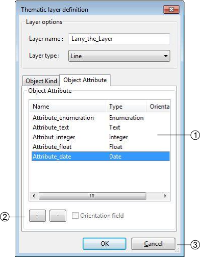

#. List of defined attributes Following operations can be realized in the list:

    * Sort attributes in alphabetical order by clicking on the Name or Type header
    * Edit an attribute characteristic by double-clicking on it
    * Reorganize the list of attributes with the contextual menu by right-clicking

#. Attributes management controls

    * [+]: Add an attribute
    * [-]: Delete one or several pre selected attributes. The suppression can also be made with the :kbd:`DELETE /BACKSPACE` keys.

#. Save or cancel the attributes modifications. An attribute is defined by:

    * A name: the name cannot contain spaces or reserved words (see :ref:`reserved_words`)
    * A type of data:

      * Text
      * Integer
      * Float
      * Date
      * Enumeration

Attribute creation
....................................

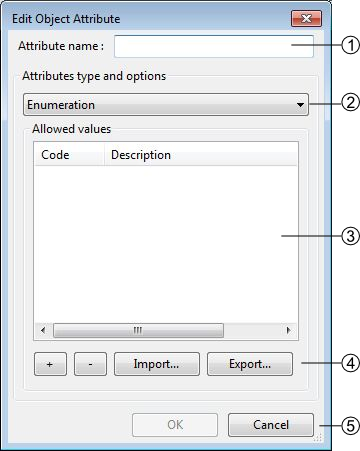

#. Attribute name
#. Attribute type
#. Attribute options: each type has different options, in this case the enumeration type. Following operations can be realized in the list:

    * Sort the values of the list by alphabetical order by clicking on the Code or Description header
    * Edit values characteristics of the list by double-clicking on it
    * Reorganize the list of values with the contextual menu by right-clicking

#. Enumeration management controls

    * [+]: add a new value
    * [-]: delete one or several pre selected values. The suppression can also be made with the :kbd:`DELETE /BACKSPACE` keys.
    * [Import]: import lists of values, two types of format can be imported:

      * \*.CSV Format: <CODE>;<Description>
      * \*.TXT Format: <CODE>[TAB]<Description>

    * [Export]: export the list of values in TXT files
#. Save or cancel the list of values modifications.

Orientation of a point type object
....................................

It's possible to orientate an object of a layer. However, several constraints have to be considered:

  * The spatial type of the layer has to be a Point type
  * The data attribute type has to be a Float or an Integer type
  * Only one attribute per Layer can be oriented.

**Activation of the orientation**

In the :guilabel:`Object Attribute` tab of the Thematic layer definition window, you have to select the attribute by clicking on it, and then activate the case Orientation Field at the
bottom of the window(1) (see also :ref:`attribute_orientation_to_point` for further information).

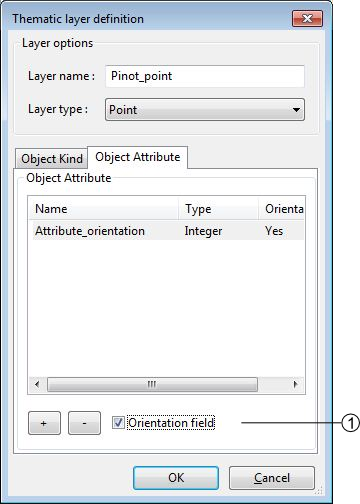

.. _proj_manage#create_from_template:

Create from template
---------------------------

The option :menuselection:`Project --> New Project --> From template...` allows you to create a new project with the same
layers/objects/attribute as an existing one. This option will create a new project from an existing
:ref:`proj_manage#template`. The creation is made through the two following steps:

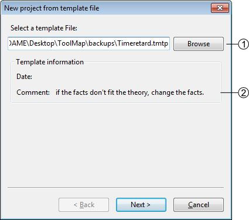

#. existing template path
#. Template information

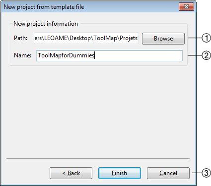

#. Directory for the new project
#. Name of the new Project
#. Creation controls:

    * :guilabel:`Back`: Return to the previous window (choose another template)
    * :guilabel:`Finish`: Create the new project with the current settings
    * :guilabel:`Cancel`: Cancel the creation of the new project

Open a project
---------------------------

There are two possibilities to open an existing project:

  * With the option :menuselection:`Project --> Open...`: open a project saved on your computer
  * With the option :menuselection:`Project --> Recent`: open a project which had already been opened recently

Special cases
^^^^^^^^^^^^^^^^^^^^^^^^^^
* The project do no more exists, it was whether deleted or moved.

  |img2|

    * If the box is checked it will automatically erase the project from the list of the recent projects.

* The folder you selected is not a ToolMap file

  |img3|

* The project was made on an older version of ToolMap and need to be upgrade

  |img4|

    * The :guilabel:`backup convert and open` option generates a backup of your project in the old version of ToolMap and upgrade the current project
    * The :guilabel:`convert only` option simply converts the version of your project. Be aware that your project will no more be readable by older version of ToolMap.

* Your version of ToolMap is not up to date, you'll have to `download <http://www.crealp.ch/fr/toolmap-telechargement.html>`_ the latest version

  |img5|

Edit a Project
---------------------------

The :menuselection:`Project --> Edit` allows editing the characteristics and components (layers, objects, attributes, settings) of the current project.

Edit the project properties
^^^^^^^^^^^^^^^^^^^^^^^^^^^^^^

The layers and attributes of the project can be modified with the :menuselection:`Project -->Edit --> Project Definition` menu.

The first tab :guilabel:`Project Properties` of the window allows modifying the properties of the project like the name of author and the eventual comments. (See chap. :ref:`proj_manage#generalities`)

The second Tab :guilabel:`Spatial Model` allows modifying the layers (see chap. :ref:`proj_manage#spatial_model`) and the attributes (see chap. :ref:`proj_manage#attributes_definition`).

.. _edit_objects:

Edit objects
^^^^^^^^^^^^^^^^^^^^^^^^^^

The objects can be modified with the menu :menuselection:`Project-->Edit-->Objects kind...` They are distributed in the three spatial kinds: point, line and polygon.

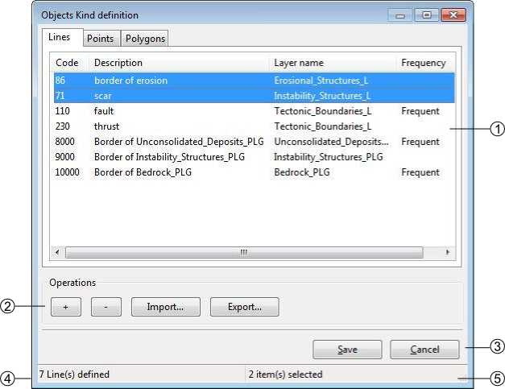

#. List of objects defined by spatial type. Following operations can be realized in the list:

    * Sort objects by alphabetical order by clicking on the Code, Description, Layer or Frequency header.
    * Edit the objects characteristics by double-clicking on it.
    * Reorganize the list of objects with the contextual menu by right-clicking.

#. Objects kind management controls

    * [+]: add an object
    * [-]: remove the selected object
    * [import]: import an object
    * [export]: export the selected object

#. Save or cancel the objects modifications
#. Number of objects in the selected spatial type
#. Number of selected objects

Edit attributes
^^^^^^^^^^^^^^^^^^^^^^^^^^

The attributes can be modified with the option :menuselection:`Project-->Edit-->Object Attribute...`

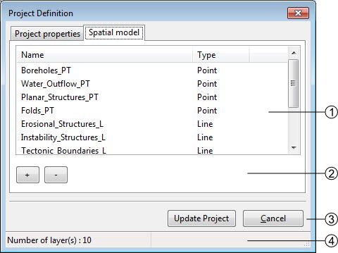

#. List of available layers, you can modify them by double-clicking on it
#. Objects management controls

    * [+]:add a new layer
    * [-]: delete the selected layer

#. [Update]: update the project saving the modifications, [Cancel]: Cancel the modifications
#. Number of available Layers

.. _proj_manage#settings:

Settings
^^^^^^^^^^^^^^^^^^^^^^^^^^

The settings edition is activated with the option :menuselection:`Project --> Edit --> Settings...`

Project Settings
""""""""""""""""""""""""""""

The project settings tab of the project settings window allows to manage the export and backup properties

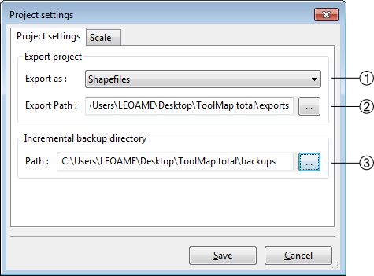

#. Export data type (Shapefile, Graphics (EPS))
#. Export file path
#. Backup file directory

Scale
""""""""""""""""""""""""""""

The scale tab of the project settings window allows managing the scales

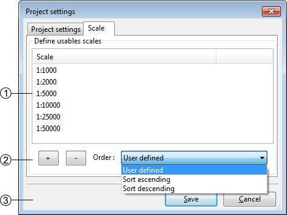

#. List of defined scales. Following operations can be realized in the list:

    * Edit a scale by double-clicking on it
    * reorganize the list of scales with the contextual menu

#. Scales management

    * [+]: Add a new scale
    * [-]: Delete one or several preselected scales. The suppression can also be made with the :kbd:`DELETE /BACKSPACE` keys
    * Management options of the scales list. The list can be ordered with the options of the :guilabel:`order` drop-down menu

      * Sort ascending
      * Sort descending
      * User defined: ordered by the user

#. Save or cancel the settings modifications

Save and restore a project
---------------------------

Backup
^^^^^^^^^^^^^^^^^^^^^^^^^^
When working on ToolMap the changes are automatically and constantly saved. Because of that it is safe to create frequent backups of the project. The :menuselection:`Project --> Backup`  menu allows you to make backups of your current project.

At the creation of a backup, you can write a comment about your save.

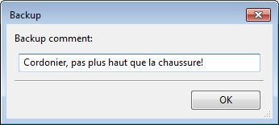

The comment will appear in the :guilabel:`Manage Backup` window.

The :guilabel:`Manage Backup` window is accessible with the option :menuselection:`Project --> Manage backup`.
This window lists all the backups stored in your backup file. The name of the backups is automatically generated following
this model: `Projectname-YYYY-MM-DD-HHMMSS`

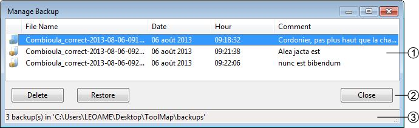

#. List of the backups with their characteristics and comment. The list can be ordred by each of the characteristics
#. Backups management controls

    * :guilabel:`Delete`: Delete the selected backup(s)
    * :guilabel:`Restore`: Restore the selected backup. When clicking on this option, a window asks you the confirmation of the restoration process.

     |img6|

    * :guilabel:`Close`: Close the window and return to your current project

#. The Backup path (beforehand defined in the :ref:`proj_manage#settings`)

.. _proj_manage#template:

Template
^^^^^^^^^^^^^^^^^^^^^^^^^^

You can create templates of your project with the option :menuselection:`Project --> Save as template`. The creation of a template is made as such:

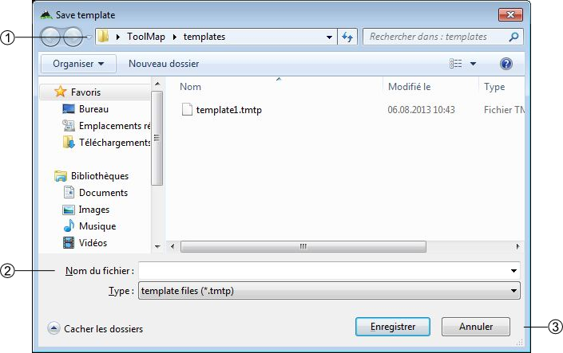

#. Path where the template will be stored
#. Name of the template and the format
#. Save the template or cancel the operation

After saving your template you can enter a comment that will appear if you use the :ref:`proj_manage#create_from_template` option.

.. image:: img/window-template-save2.png

#. Comment on the template

.. _proj_manage#merge-projects:

Merge projects
---------------------------

Another project can be merged into the current project with the option :menuselection:`Project --> Merge projects`. Only projects based on the same data model can be merged (this is tested before merging). Before proceeding to the merge, a backup of the current project is performed.

A window will open to choose the other project that will be merged into the current project:

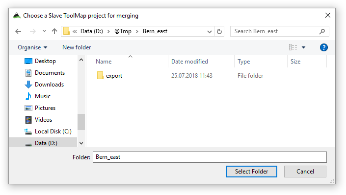

Then, a confirmation will be requested before proceeding to the merge:

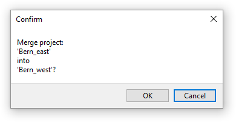

The merge is finally performed.

.. _proj_manage#export-a-project:

Export a project
---------------------------

Export Layers
^^^^^^^^^^^^^^^^^^^^^^^^^^

The exportation allows generating layers, which were defined at the spatial model level in order to be used in others programs. The export path and format have to be beforehand defined (see chap. :ref:`proj_manage#settings`)

The exportation is made with the option :menuselection:`Project --> Export Layer...`. When selecting this option the following window appears:

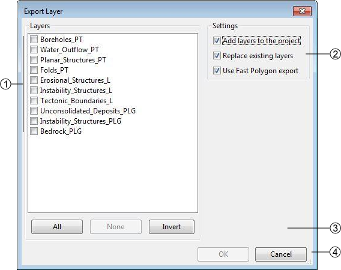

**Layers**: List of the layers defined in your data model (previously exported layers are automatically selected). Layers selection controls:

    * All: select all the layers
    * None: remove all the selected layers
    * Invert: invert your current selection

**Settings** 

    * Overwrite existing files (if disabled an increment will be added to the exported files)
    * Add layers to the project
    * Replace existing layers (only when the option to add layers to the project is selected)
    * Use Fast Polygon export
	* Export empty layer

**Attributes (Enumeration)**

    * Export description
    * Export code

When Exporting a Polygon Layer, ToolMap automatically create a column "NB_LABELS" in the resulting file. This column is filled for each polygon with the number of labels inside that polygon.

.. _export-model-as-pdf:

Export Model as PDF
^^^^^^^^^^^^^^^^^^^^^^^^^^

Once the spatial model of a project is set, you can get a PDF layout of it using the Export Model as PDF tool
(:menuselection:`Project --> Export --> Export Model as PDF...`).

The following window will then open :

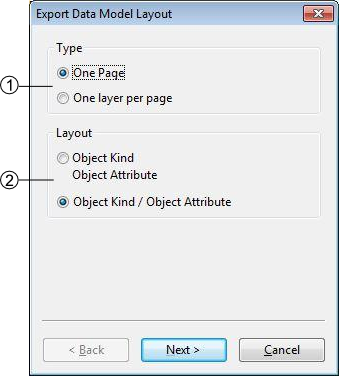

#. Choose to either print your data model on a single page or with one layer only per page. The later allows you to choose between several paper sizes (from A0 to A4) and orientation (Portrait or Landscape).
#. Choose the layout of your data. The upper option will display Object Attributes below the Objects Kinds, the lower option will display them next to each other.

Checking the "use very simple decorations" box in the next window will allow you to print a lighter version of the document.

Close the Project
---------------------------

To quit the project, you just have to click on the upper-right icon or select the option :menuselection:`Project --> Exit`.

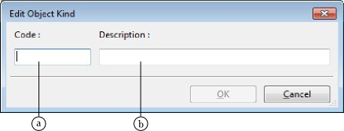
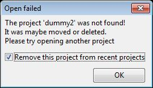
.. |img3| image:: img/window-openfailed-project.png
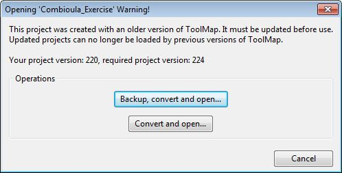
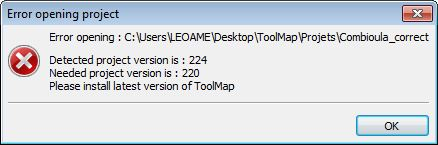
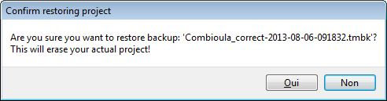
