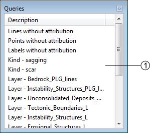
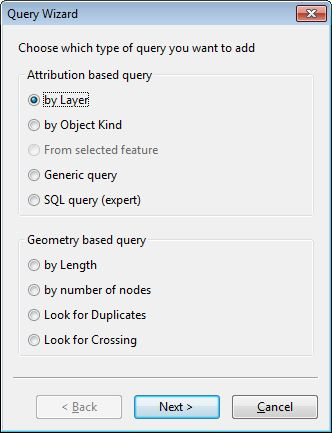
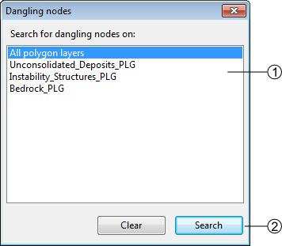
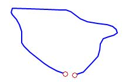
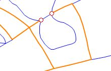
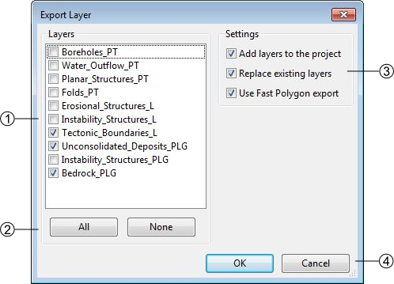
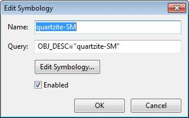
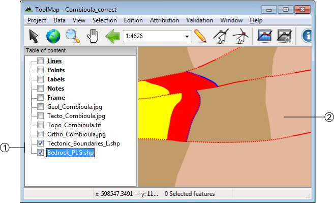
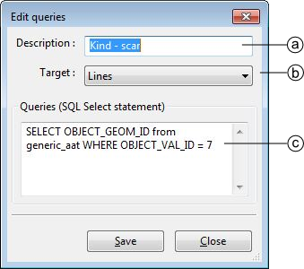

Validation
================

The validation allows verifying the geometrical and semantic meaning of the objects. It is done with the menu :guilabel:`Validation`:

  * Queries Panel
  * New query
  * Remove selected query
  * Run selected query
  * Dangling Nodes

.. _semantic-validation:

Semantic Validation
-----------------------------------

The semantic validation of your data is made with the use of queries. The queries are available in the Queries panel. You can activate it by clicking on the :menuselection:`Validation --> Queries Panel`.

#. List of available queries. Several operations are available with a contextual menu:

    * Run query: run the selected query.
    * Use query for symbology: directly assign the query to the multiple symbology of the correspondant layer.
    * Edit query SQL: Open the Edit queries window allowing you to work on the SQL code of your query.

    |img1|

        a. Query description
        b. Construction layer on which the query will be applied
        c. Definition of the query in SQL language

    * Add query: Display Query wizard allowing you to easily create a new query.

There is basically two types of queries; the attribution and the geometry based queries:

Attribution based
    Those queries look for the attribution of the features to sort them out. While the queries on the object kinds are very good to search for precise features, the queries calling the layers are often more suited to highlight the general structures.

Geometry based
    Those queries only call the structures of the features stored in the construction layers. Their main goal is to prevent the existence of unnecessary features or structural errors.

Geometrical Validation
-----------------------------------

The :guilabel:`Validation` menu includes the option :guilabel:`Dangling Nodes...` which allows to highlight the geometrical errors of the lines related to polygonal layers. The problematic nodes are identified with a red and white circle. The geometrical validation tool window looks like the following:

#. Research extent
#. [Search]: search the errors [Clear]: clear the highlighting of the errors

There is basically two types of errors:

.. _dangling-nodes:

Dangling nodes
^^^^^^^^^^^^^^^^^^^^^^^^^^^^^^^^^

The polygon is not closed. This is mainly due to a bad snapping. Make sure to use the snapping panel efficiently.

Missing attribution
^^^^^^^^^^^^^^^^^^^^^^^^^^^^^^^^^

The nodes are correctly snapped but the segment between the highlighted nodes is badly attributed, it shall have the same object kind as the orange lines. This is actually a semantic error, but sometimes you can miss it with the queries because of very small lines.

Redactor Mode
-----------------------------------

The redactor mode allows you to export your layers and reimport them into ToolMap so you can check the consistency of your data.
The process is made with the :menuselection:`Project --> Export Layer...` menu.

#. List of all your layers, check those you want to reimport as shapefile
#. Layers selection controls
#. Settings

    * Add layers to the project: If checked, automatically import the layer(s) into the project.
    * Replace existing layers: If checked, replace the pre-existing version of the same layer.
    * Use fast polygon export: If checked, ...

#. Validate or cancel the operation

The reimported layers will appear in the table of content as support layers. Like other layers you can access to the symbology window with the contextual menu. This window allows you to classify the different objects in your layers.

.. image:: img/window-redactor3.png

#. List of auto generated filters for the classification. The layer can be classified with:

    - the objects kind
    - the attributes (if some)
    - the number of labels lying in each polygon

#. List of the generated classes depending of the selection in (1). The classes are actually generated with queries. You can modify them for improved classes.
#. Symbology controls:

    * Classify: Generate the classes depending of your choice in (1)
    * Add: Add a new class, you will have to write the query yourself
    * Remove: Remove the selected class
    * Remove all: Remove all the classes

#. Validate or cancel the changes

By double-clicking on a class you can edit its own symbology.

Several options can be changed:
  * you can enable/disable a class by checking or not the option. The disabled classe is not displayed in the GIS Window and its name appears grayed in the symbology list.
  * You can change the visual effect of your class by clicking on edit symbology; you are able to change the style, the color the width and the transparency.

Those layers can then be displayed like any other support themes.

#. Reimported layers
#. Example of two layers with edited symbology.

The redactor mode is very usefull to sort out the labelization errors. The classification with the number of labels lying in each polygon grant you an easy view of the missing or excess labels.

