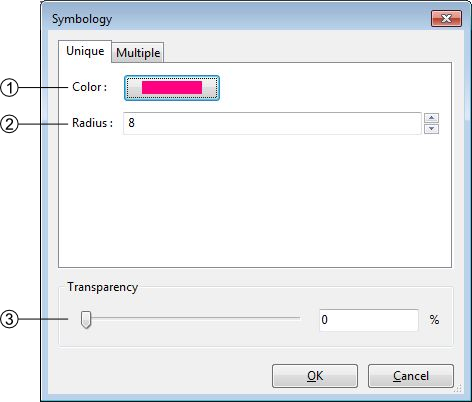
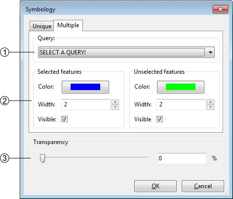
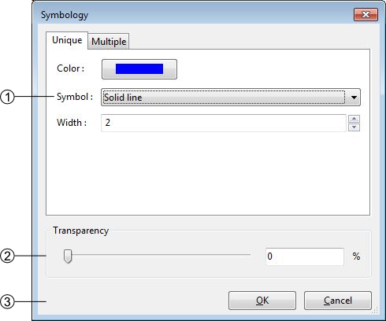
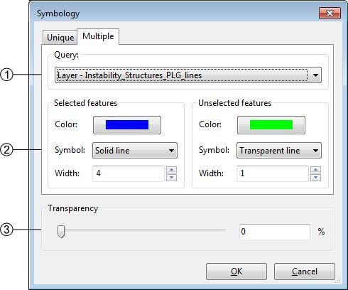
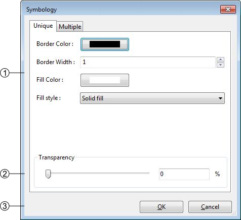
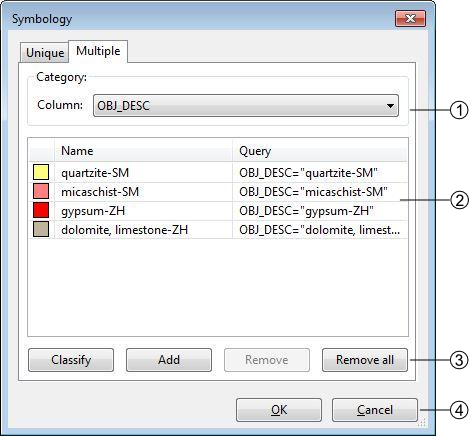
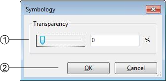

Visualization
================

The different tools allowing you to explore your project in the visualization window are stored in the :guilabel:`View` menu, it regroups the following elements:

  * :guilabel:`Previous zoom` (:kbd:`<`): go back to the previous displayed scale, available only if you have once changed the scale
  * :guilabel:`Zoom by rectangle` (:kbd:`Z`): This tool uses a click-release action, click on the left button of the mouse and drag it, it makes a rectangular ghost. The zoom factor is inversely proportional to the size of the rectangle. The type of zoom is determined by the direction of the drag:

        * Left to right: zoom in
        * Right to left: zoom out

  * :guilabel:`Pan` (:kbd:`H`): Move the map with a drag and drop action
  * :guilabel:`Zoom to full extend` (:kbd:`Ctrl+0`): Adjust the scale to display all the activated layers
  * :guilabel:`Zoom to frame` (:kbd:`Ctrl+1`): Adjust the scale to display the frame.
  * :guilabel:`zoom to layer` (:kbd:`Ctrl+2`): Adjust the scale to display the whole selected layer
  * :guilabel:`Refresh` (:kbd:`Ctrl+R`): Refresh the screen

.. _symbology:

Symbology
----------------

The symbology windows allow you to manage the style of each layer. You have several options available depending of the layer style. They are accessible by double clicking on the layer name in the table of content or with the option :guilabel:`Symbology...` of the contextual menu.

The symbology can be exported to a file with the option :guilabel:`Save symbology...` of the contextual menu or imported with the option :guilabel:`Load symbology...`.

Points
^^^^^^^^^^^^^^^^^^^^

#. Points style management: you can change the color and the radius of the points
#. Transparency management
#. Apply or cancel the modifications

The points have an additional option found on the other tab of the window (:guilabel:`multiple`). Under this tab you are able to attribute two different symbology to your lines. The differentiation of the points is made through the queries (see :ref:`semantic-validation`).

#. Query selected for the differentiation
#. symbology management of the two classes
#. transparency management

The symbology is directly connected to the attribution of the point, changing its attributes may instantly change its symbology. This option can be very helpful to highlight specific classes.

.. _visualization#lines:

Lines
^^^^^^^^^^^^^^^^^^^^

#. Lines style management, you can change the color the width  and the symbol of the lines. There are six choices of shape. Choices are:

    #. Solid line
    #. Dotted line
    #. Dashed line
    #. Dot-dashed line
    #. Transparant line: The Transparent line option may be used to hide the lines.
    #. Oriented line: The Oriented line option display a double line: solid and dotted side by side. This option can be used to check for consistency when some lines have to be drawn in a certain direction.

#. Transparency management
#. Apply or cancel the modifications

The lines have an additional option found on the other tab of the window (:guilabel:`multiple`). Under this tab you are able to attribute two different symbology to your lines. The differentiation of the lines is made through the queries (see :ref:`semantic-validation`).

#. Query selected for the differentiation
#. symbology management of the two classes
#. transparency management

The symbology is directly connected to the attribution of the line, changing its attributes may instantly change its symbology. This option can be very helpful to highlight specific structures.

Polygons
^^^^^^^^^^^^^^^^^^^^

#. Polygons style management: you can change the border width and color as the fill color and style. Following styles are available:

    #. Solid fill
    #. Backward Diagonal hatch
    #. Forward Diagonal hatch
    #. Cross hatch
    #. Vertical hatch
    #. No Fill

#. Transparency management
#. Apply or cancel the modifications

If your imported polygons have attributes, you can class them to have a multiple symbology. (see also :ref:`redactor-mode`)

#. List of attribute header
#. List of the different attributes related to the header
#. Symbology controls:

    * Classify: Generate the classes depending of your choice in (1)
    * Add: Add a new class, you will have to write the query yourself
    * Remove: Remove the selected class
    * Remove all: Remove all the classes

#. Validate or cancel the changes

Images
^^^^^^^^^^^^^^^^^^^^

#. Transparency management
#. Fusion: the raster data can be multiplied with the underlying layers to provide a more contrasted fusion.
#. Apply or cancel the modifications